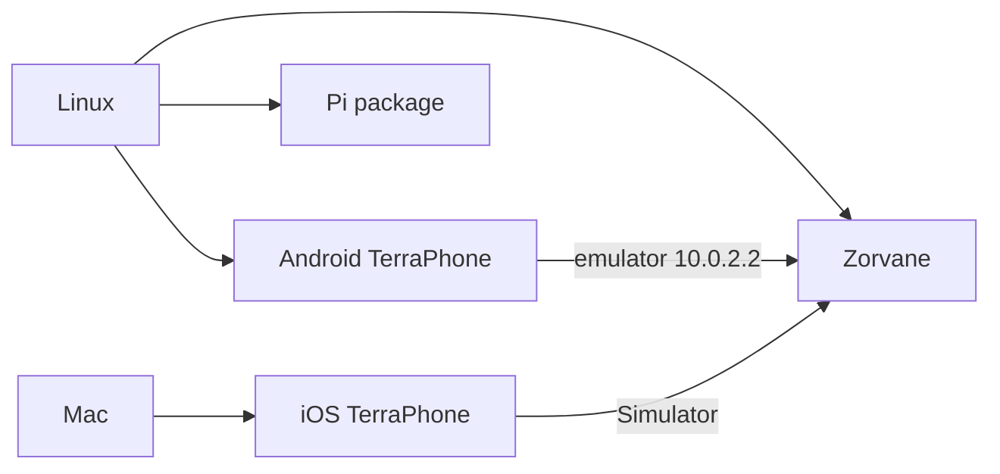

# Develop the world without a Mac

!!! tip "TL;DR"
    Zorvane runs on Linux.
    The Android shell builds on Linux.
    The iOS app still needs a Mac.
    The Pi image also builds on Linux, with Docker.

*World loop does not need this splash. The app does.*

*From a [Zorvane](https://super-yojan.dev/Zorvane/) checkout: `cargo run -p zorvane`.*

`TERRA_TILES`, `TERRA_ROVER_COUNT`, `TERRA_MISSION`, and `TERRA_ZENOH_LISTEN` still apply. Default listen is `tcp/127.0.0.1:7447`.

Build notes: [Zorvane README](https://github.com/Super-Yojan/Zorvane/blob/main/README.md).

iOS: `./scripts/build-ios.sh` on a Mac. See [Xcode](phone/build.md).

Android, from this checkout: `./scripts/build-android.sh`, then `mobile/android/gradlew assembleDebug`. See [TerraPhone for Android](MOBILE_ANDROID.md).
