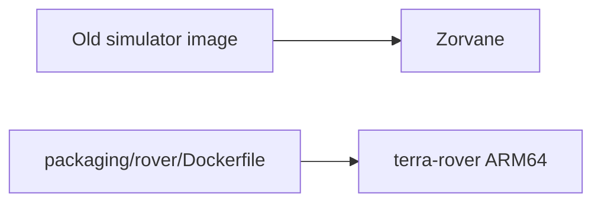

# Simulator image

!!! tip "TL;DR"
    The Bevy container moved to [Zorvane](https://super-yojan.dev/Zorvane/).
    This repo’s container builds the Pi executable.



*Prefix is still `terra/rover`. `TERRA_*` variables still apply in Zorvane.*


*Install steps: [compiled Pi executable](hardware/INSTALL.md).*

```sh
cargo run -p zorvane
```

Run that from a Zorvane checkout, not from this tree.
