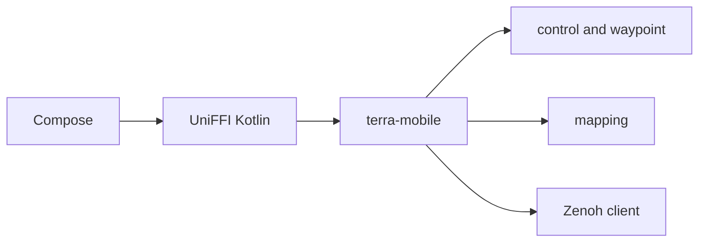

# TerraPhone for Android

!!! tip "TL;DR"
    Kotlin and Compose shell.
    The controller is still `terra-mobile`.
    Emulator talks to Zorvane at `10.0.2.2`.
    A physical phone does not open Zenoh.



*Same crates as the iOS app. Kotlin samples sensors and draws the screen.*

## What you need

- Rust stable, with `aarch64-linux-android` and `x86_64-linux-android`.
- [cargo-ndk](https://github.com/bbqsrc/cargo-ndk) 3.5.4 (`cargo install cargo-ndk --version 3.5.4 --locked`).
- Android SDK platform 35, build-tools 35.0.0, and NDK r27.
- JDK 17 or newer.
- A device or an emulator image. The debug APK ships `arm64-v8a` and `x86_64`.

`ANDROID_NDK_HOME` must point at the NDK directory (the one that contains `source.properties`). `ANDROID_HOME` is enough for Gradle. If `ANDROID_NDK_HOME` is unset and `ANDROID_HOME/ndk/<version>` exists, `scripts/build-android.sh` uses the newest one there.

## Build and run

From the repository root:

```sh
export ANDROID_HOME="$HOME/android-sdk"
export ANDROID_NDK_HOME="$ANDROID_HOME/ndk/27.2.12479018"
./scripts/build-android.sh
cd mobile/android
./gradlew assembleDebug
```

`build-android.sh` builds the host `libterra_mobile.so` (the JVM smoke test loads it), generates the Kotlin bindings, and places release `.so` files in `app/src/main/jniLibs`. Those outputs are gitignored, the same way `mobile/ios/Generated/` is.

UniFFI 0.31 names exception fields `message`. Kotlin 2 rejects that because it clashes with `Throwable.message`. The script renames those generated properties to `errorMessage`. The workspace uniffi pin stays `0.31.1`.

Install `app/build/outputs/apk/debug/app-debug.apk`. On an emulator, start Zorvane on the host so the guest can reach it:

```sh
TERRA_ROVER_COUNT=1 TERRA_ZENOH_LISTEN=tcp/0.0.0.0:7447 cargo run -p zorvane
```

The default endpoint in the emulator UI is `tcp/10.0.2.2:7447`, rover `0`. `10.0.2.2` is the emulator's name for the host. Connect starts at zero. Stop, and leaving the app, close the session with a final zero. The Rust publisher still expires its 250 ms command lease if the UI stops refreshing it.

## Connection surfaces

The check is the emulator fingerprint (`goldfish` / `ranchu` / SDK build), not a settings toggle.

| Target | Zorvane · Zenoh | Bluetooth actuators |
| --- | --- | --- |
| Emulator | Shown. Endpoint and rover ID persist. Connect publishes `cmd_vel` and subscribes to that rover’s depth camera. | Hidden. |
| Physical phone | Hidden. Launch deletes any stored endpoint and rover ID. | Section is present and explains that the GATT client is not in this build. |

**Simulated rover** is the local motor plant from `SimulatedPlant`. It is on both targets. **Phone IMU + VIO** needs a physical device with camera permission, a gyroscope, linear acceleration, and ARCore. The emulator reports that phone tracking is unavailable.

## Sensor contract

Timestamps are seconds on one monotonic clock: `SensorEvent.timestamp` and ARCore `Frame.getTimestamp()`, both elapsed-realtime nanoseconds converted to seconds. Body axes stay X forward, Y left, Z up.

`device_vector_to_body` turns the flat-phone device frame (X right, Y toward the top edge, Z out of the screen) into that body frame. Core Motion and Android `SensorManager` share it. Android linear acceleration is already m/s². Core Motion user acceleration is in g, and the iOS app still multiplies by 9.80665 after the shared rotation.

`y_up_camera_to_body_pose` converts an ARKit or ARCore Y-up camera pose into the robotics body pose. `PoseVelocityFilter` is the 30 ms smoother. Tracking loss pushes `tracked = false`, and the Rust controller commands neutral effort. A missing or unsupported ARCore install does not invent a pose. Leaving the foreground calls `stop()`, which resets the controller and, on the emulator, disconnects Zenoh.

Phone depth, when ARCore Depth is supported, uses the smoothed 16-bit image (`acquireDepthImage16Bits`). That image has no confidence plane; raw confidence belongs to the raw depth image and is not applied here. Zero millimetres become NaN. Intrinsics are rescaled onto the depth image and the pose goes through `y_up_camera_to_optical_pose` into `MobileOccupancyMap`. The first camera height is latched to 0.5 m by `latch_ground_offset`. Devices without depth keep velocity control and say so. This phone path has not been run on hardware.

## Waypoint

**Go to waypoint** calls `MobileWaypoint.setOrigin` and `setGoal`. While the goal is latched the sliders stay idle. Each tick steps the follower with the simulated plant pose, the phone body pose, or the Zorvane depth frame’s body pose, and that twist is the command. On Zenoh it is `cmd_vel`. The `goal` topic stays idle during that run, so Zorvane does not latch a second follower. **Cancel waypoint**, Stop, and leaving the app drop the latch. **Johnson Center, 12 m north** fills the same default fields as iOS. The reachable square is 49 m. Map taps use `geographicPosition`.

## Autonomy

The picker lists `supported_autonomy_levels()`: teleop, assisted teleop, waypoint, and supervised search. **Explore** is drawn disabled. `supported_autonomy_levels` matches on every `terra_autonomy::Level` variant, so adding frontier exploration (`explore`, issues #32 and #33) fails that function to compile until the wire name is added. The chip then enables itself.

Level changes go out as `autonomy` actions. Emergency stop and reset go out as `safety`. Approving or rejecting a search target sends `goal/decision`. On the emulator those are Zenoh puts. Locally they are `MobileController.autonomyRequest`.

## Tests

```sh
cargo test --locked --workspace
./scripts/build-android.sh
cd mobile/android && ./gradlew assembleDebug testDebugUnitTest
python3 scripts/check-zenoh-kotlin.py   # needs the eclipse-zenoh Python package
```

`TerraCoreSmokeTest` constructs `MobileController`, steps a sample, and checks that the right wheel effort is larger and that a one-second gap returns zero. It also calls the shared axis conversion, `MobileWaypoint`, and `runVelocityBenchmark`. With `TERRA_ZENOH_SMOKE_ENDPOINT` set, the same test opens `MobileZenohClient` against a Python peer, checks `terra/rover/9/cmd_vel`, the moving payload, lease expiry to zero, the final zero from `disconnect`, and that one posed depth frame occupies a cell.

## What was verified, and what was not

Verified on Linux, without a phone:

- `cargo test --locked --workspace`.
- `./scripts/build-android.sh` for `aarch64-linux-android` and `x86_64-linux-android`.
- `./gradlew assembleDebug` and `testDebugUnitTest`.
- `scripts/check-zenoh-kotlin.py` against a Python Zenoh peer (topic, payload, lease zero, disconnect zero, depth integration).
- A headless Zorvane process (`TERRA_HEADLESS=1`, `TERRA_ZENOH_LISTEN=tcp/0.0.0.0:7447`) published `terra/rover/0/camera/depth`. A Zenoh client on `tcp/127.0.0.1:7447` received that frame, and a forward `cmd_vel` moved the rover body. The same `MobileZenohClient` the app uses connected from the host JVM, published a reverse target, and the sampled body pose moved backward. Depth delivery on that session was sparse (a handful of frames), so this was not a UI drive and not a measured closed-loop run.

Not verified:

- An Android emulator UI session. An API 35 AVD was created and QEMU started with KVM, but the process never created vCPUs and adb stayed offline, so the APK was not installed. No demo was recorded.
- ARCore tracking, depth, or the flat-phone mount on hardware.
- Bluetooth. The GATT client is a follow-up. Rust framing (`actuator_route`, `actuator_encode_frame`, `actuator_fragment`) is already what that client should call.
- The iOS app after the Swift call sites moved onto the new UniFFI functions. Rebuild with `./scripts/build-ios.sh` on a Mac before running TerraPhone there. The new functions are additive. Swift still sends a waypoint as an arbiter `goal` rather than stepping `MobileWaypoint` itself.

## iOS follow-up on a Mac

`PhoneController` now calls `deviceVectorToBody`, `yUpCameraToBodyPose`, `yUpCameraToOpticalPose`, `latchGroundOffset`, `PoseVelocityFilter`, `SimulatedPlant`, and `simulatedRoomDepth`. Those symbols appear only after `./scripts/build-ios.sh` regenerates `mobile/ios/Generated`. This checkout cannot run `xcodebuild`.
