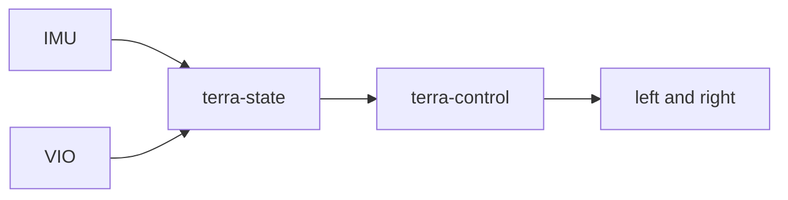
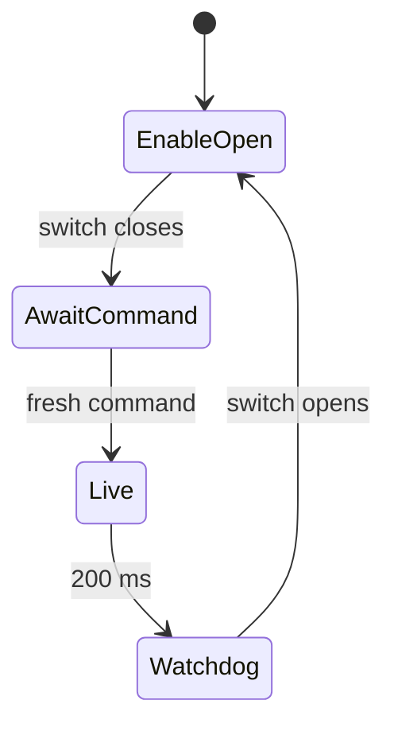

# Phone velocity controller

!!! tip "TL;DR"
    IMU plus VIO becomes left and right effort.
    Simulator Zenoh and iPhone Bluetooth are different builds.
    Zero effort coasts. It is not a brake.


*Wireframe of the controller this page describes. Not a Simulator capture.*



*Onboard loop this section sits on.*

See the [mission-autonomy guide](autonomy/README.md) for four shared-core levels, explicit waypoint authority, safety controls, and experiment logs.

The reusable pipeline is IMU + VIO → estimated body velocity → velocity controller → signed left/right motor effort. Both efforts are normalized to [-1, 1]; positive effort drives forward. The `terra-motors` adapter maps magnitude to PWM duty and sign to direction, after a hardware enable gate and an independent command watchdog. It does not toggle GPIO itself. TerraPhone also implements Zenoh simulator control and Bluetooth actuator commands; the Pi backend owns physical output writes.

Build and verification commands below describe future developer workflows. The
Bluetooth implementation has no execution evidence: none of these commands were
run for this feature. See [evidence status](hardware/evidence/README.md).

## Build and run

Run `./scripts/build-ios.sh` on a Mac with Xcode, Cargo and Rust targets `aarch64-apple-ios`, `aarch64-apple-ios-sim`, and `x86_64-apple-ios` installed. It generates the Swift bindings and an XCFramework for iPhone and both simulator architectures. Generated artifacts are ignored by Git. Open `mobile/ios/TerraPhone.xcodeproj`, select a signing team and run TerraPhone. The deployment target is iOS 17.

The app offers a simulated sensor mode and a phone sensor mode, plus a repeatable Rust benchmark. Simulator mode exercises the same UniFFI controller without requiring a camera. Phone mode reads Core Motion's gravity-free acceleration and angular rate and estimates world velocity from ARKit poses. Camera permission and a device supporting AR world tracking are required for phone mode. Loss of tracking produces neutral effort. Leaving the foreground stops the controller.

The Android shell in `mobile/android/` calls the same crate. Its build, the emulator Zenoh endpoint `tcp/10.0.2.2:7447`, and what has not been run on a device are in [TerraPhone for Android](MOBILE_ANDROID.md).

Which hardware link the connection UI shows depends on the run destination. See [Connection surfaces](#connection-surfaces).

`./scripts/check-swift.sh` validates a real Swift → UniFFI → Rust call and runs the controller benchmark. `cargo test --workspace` checks the Rust modules. Acceleration, turning, and stopping through Avian motor forces are covered by Zorvane's headless physics tests (`cargo test -p zorvane` in that repo).

## Connection surfaces

TerraPhone compiles one hardware link for each target. The check is `#if targetEnvironment(simulator)` in `ContentView` and `PhoneController`. On launch, `TerraPhoneApp` clears a saved Bevy endpoint through that same check. There is no setting that shows the Bevy section on a physical iPhone.

| Target | Bevy simulator · Zenoh | Bluetooth actuators |
| --- | --- | --- |
| iOS Simulator | Shown. Endpoint and rover ID persist in the Simulator’s defaults. Connect still publishes `cmd_vel` and subscribes to that rover’s depth camera. | Hidden. The Simulator has no Bluetooth radio, so Discover and Connect cannot reach a rover. |
| Physical iPhone | Hidden. The section is not in the device connection UI. Launch deletes any stored `zenohEndpoint` and `zenohRoverID` from an older build, and `startBevy` does not open a session. | Shown. This is the path to a real rover. |

**Simulated rover** in the Controller section is the local motor plant. It stays on both targets. The Bevy process is the separate Zenoh section, and only the Simulator build includes that section. **Phone IMU + VIO** still needs a physical iPhone with ARKit.

Bluetooth is omitted from the Simulator on purpose. CoreBluetooth is unsupported there (`CBCentralManager` cannot scan or connect), so those controls would sit next to the link that does work: Bevy at `tcp/127.0.0.1:7447` on the same Mac. A device that previously saved a Bevy endpoint or rover ID falls back to the Bluetooth section. It does not reconnect to Zenoh and does not show the saved endpoint.

## Sensor contract

All timestamps are seconds on the same monotonic clock. IMU and VIO samples must increase independently; delayed VIO is replayed against recent IMU history. Body axes are X forward, Y left, Z up. Acceleration is in m/s² with gravity removed; gyro is in rad/s. VIO supplies position and velocity in a consistent world frame and an XYZW quaternion rotating body vectors into that world frame. Samples and configuration are validated at the Rust boundary.

The estimator anchors velocity to VIO and integrates IMU only between fresh VIO updates.
It is not a visual odometry implementation or a full bias-estimating filter.
The default IMU timeout is 100 ms and VIO timeout 350 ms; the target timeout is 500 ms.
Missing, stale, invalid or untracked inputs yield zero motor effort.
The controller accepts forward velocity and yaw rate, limits targets, mixes the two PI outputs into wheel efforts, preserves their ratio on saturation, and uses back-calculation anti-windup.


## Mounting and tuning

The starter app assumes the phone lies flat, screen upward, with its top edge pointing forward.
Core Motion phone axes are converted to rover axes; ARKit poses are converted into a Z-up world and the same body frame.
The app treats the sensor origin as the rover origin.
Before physical motor integration, calibrate the mount rotation and sensor offset, account for offset-induced rotational velocity, and tune gains, feedforward, limits and sensor filtering for the actual rover.
Defaults are tuned for the included simulated motor plant.


Zero effort means coast, not a mechanical brake. The motor adapter, enable switch, and command watchdog are specified in [Motor adapter](#motor-adapter). Physical phone sensing and hardware actuation have not been validated on a rover.

## Waypoint follower

`terra-waypoint` turns one WGS84 goal into a body twist. TerraPhone imports `MobileWaypoint` from the same UniFFI bundle as `MobileController`. The **Waypoint** section of the app is that call.

Start **Simulated rover**, **Phone IMU + VIO**, or **Connect to Bevy rover**. Then set the origin and the goal, or tap the occupancy map. The orange marker is the goal in the same metres as the blue rover: +X north, +Y west. **Johnson Center, 12 m north** fills latitude 38.82981, longitude −77.3075, about 12 m north of the George W. Johnson Center. **Go to waypoint** calls `setOrigin` and `setGoal`. While that goal is latched the phone steps the follower and the velocity sliders stay idle. **Cancel waypoint** returns to the sliders. Stop, or leaving the app, drops the latch.

On a Bevy connection the pose comes from the depth frame's body position, and the twist is published as `cmd_vel`. Leave `terra/rover/<id>/goal` idle during this run. A goal latched inside Zorvane owns the wheels until `{"cancel":true}`. With `TERRA_TILES=1` the world origin is the Johnson Center, which matches the default fields. The reachable square is 49 m from the origin. Keys stay `terra/rover/<id>/…`.

```swift
let follower = try MobileWaypoint(settings: defaultWaypointSettings())
try follower.setOrigin(latitude: 38.8297, longitude: -77.3075)
_ = try follower.setGoal(latitude: 38.82981, longitude: -77.3075, yaw: nil, token: "gmu-north", halfExtent: 49)
let step = try follower.step(x: vioNorth, y: vioWest, yaw: heading)
try controller.setTarget(target: TwistSetpoint(timestamp: now, forward: step.forward, yawRate: step.yawRate))
```

`setGoal` returns false when the origin is missing or the point lies outside `halfExtent`. `cancel` drops the latch. `step` reports `latitude` and `longitude` of the goal; `localX` and `localY` are the tangent-plane metres the follower is steering toward. `tangentMetres` and `geographicPosition` are the same projection the map tap uses. Zorvane's Zenoh bridge calls this crate when a goal arrives on `terra/rover/<id>/goal`, so a headless run uses the same follower.


*Onboard loop this section sits on.*

## Motor adapter

`terra-motors` sits behind `MotorOutput`. `map_effort` converts one signed effort to a PWM duty in `[0, 1]` and a direction. `MotorAdapter` applies that to both wheels and returns a `ChassisPwm` to write to the driver. The iOS UI does not call it. Zorvane turns controller effort into Avian forces rather than PWM. Run `cargo test -p terra-motors` for the mapping, enable gate, and watchdog tests. Crate details and the bench checklist are in [crates/terra-motors/README.md](https://github.com/Super-Yojan/Terra/blob/main/crates/terra-motors/README.md).

### PWM

Positive effort is forward. `WheelPwm::sign_magnitude` is `(DIR, duty)` with DIR asserted for forward. `WheelPwm::in1_in2` is `(in1, in2)` with at most one input nonzero. `duty_counts` quantizes a duty onto a timer period such as 255. Efforts outside `[-1, 1]`, or non-finite efforts, coast both wheels and drop driver enable.

### Enable switch

The adapter boots as if the switch is open. `set_hardware_enable(false, now)` coasts both wheels and sets `drive_enabled` false. Closing the switch does not replay a previous effort; hold stays `AwaitCommand` until `apply` runs while the switch remains closed. The returned `ChassisPwm` is the software gate in front of PWM.

The physical switch also has to be able to remove motor power or the driver enable pin when this process is not running. Sample it every motor tick and write the returned `drive_enabled` level. A driver that brakes when disabled is a property of that chip; this adapter never commands brake mode.

### Watchdog

`MotorWatchdog` is separate from the controller's 500 ms target timeout. The default motor `command_timeout` is 200 ms (config allows up to 1 s). Age is `now - commanded_at`, where `commanded_at` is when the effort was produced. `poll` uses the latched stamp. Applying the same stamp again does not extend the window. On expiry, hold is `Watchdog`, both duties are 0, and `drive_enabled` is false. A newer fresh command may drive again without recycling the switch.

`apply_effort_now` stamps the sample at the call time. Use it only for an effort computed on that tick. A bridge that repeats the last packet must keep the original `commanded_at` and call `poll` when nothing new arrived.

### Fail-safe

Zero effort is coast: duty 0, no direction, IN1 and IN2 both low. It is not a mechanical brake and not an electrical short across the motor. A fresh stream of controller zeros (phone backgrounded, tracking lost, or a stale velocity target) keeps the watchdog kicked, so `drive_enabled` stays true while the switch is closed and the wheels coast. The chassis can roll.

If commands stop arriving, or the last producer stamp ages out, the watchdog coasts and deasserts `drive_enabled`. That is still not a brake. Loss of the phone link only drops driver enable when the robot stops refreshing `commanded_at`. Open the hardware switch before the wheels are on the ground. An invalid effort, a backwards adapter clock, a producer time in the future, or an older stamp than the one already latched also coast and drop enable.

### Bench

Wheels off the ground. No autonomy stack. Logic power until the enable path is confirmed.

1. Switch open. Apply `+1` / `-1`. Duties stay 0 and `drive_enabled` is false.
2. Close the switch without a new command. Outputs stay in coast (`AwaitCommand`).
3. Apply left `+0.5`, right `-0.25`. Left half-scale forward, right quarter-scale reverse, enable asserted.
4. Apply `0, 0`. Duties go to 0. Enable may stay asserted. Wheels coast; they do not brake. Confirm both H-bridge inputs are low.
5. Stop new stamps. Within the watchdog window, enable drops and duties stay 0. A wheel turned by hand coasts.
6. A new stamp may drive again. Opening the switch drops PWM immediately.
7. Stopping the phone link or the control process follows step 5 when stamps stop advancing. The chassis is not braked.

## Simulation


*The phone shows effort. The Pi or Zorvane applies it.*


That closed loop now runs in [Zorvane](https://super-yojan.dev/Zorvane/) (`cargo run -p zorvane`). Each rover gets its own estimator and controller. Avian velocity and orientation provide synthetic IMU and 20 Hz VIO feedback, while controller effort produces forces and yaw torque. This tests the control loop rather than calculating VIO from rendered images. `VelocitySimulationConfig` exposes sensor enable switches, sensor frequency, motor force and drag for experiments. Disabling its `enabled` field restores the existing ideal drive model. Fleet changes and Zenoh velocity commands on `terra/rover/<id>/cmd_vel` remain supported. `TERRA_*` variables still apply.

## iOS occupancy view

The app shows the Rust local occupancy grid, rover position/heading, map scale and a clear action. Simulated mode generates room-wall depth observations at 10 Hz through the same UniFFI mapping object. Phone mode requests ARKit `sceneDepth` only when supported, rescales camera intrinsics to depth resolution, filters low-confidence returns and passes each depth map with that ARFrame's camera pose and timestamp. Mapping pauses while tracking is lost. Unsupported devices retain velocity control and show that depth is unavailable.

The map is world-aligned: +X right and +Y upward on screen.
Free cells are green, occupied cells use the primary foreground, unknown cells are faint gray and uncertain observed cells are darker gray.
The blue marker indicates rover pose.
Initial phone camera height is assumed to be 0.5 m over a flat ground reference; physical mounting and ground height require calibration.
Phone depth comes from the rear camera's optical pose, independently of the rover-body mounting rotation.
Stop preserves the map; starting either mode creates a new map.


Bevy Zenoh mode uses the same grid. It does not subscribe to an occupancy topic. Each Zorvane depth packet carries the exposure-aligned optical camera pose and the rover body pose in the robotics frame (the same conversion Zorvane uses for its own per-rover map). The phone recenters on the body position, integrates axial depth through `MobileOccupancyMap`, and draws the body heading. Ground is robotics Z = 0, which is the world floor (Bevy Y = 0); the 0.5 m phone-height assumption is not used. Depth packets without an exposure pose are ignored. Body pose is sampled with the camera at exposure time, so the marker matches the depth frame rather than a later odometry estimate. There is still no published map snapshot for ARGOS or other operators.

## Drive Bevy from TerraPhone over Zenoh

TerraPhone exposes the Rust `terra-transport` client through UniFFI in the **iOS Simulator** build only. Use the **Bevy simulator · Zenoh** section to configure an endpoint and rover ID, then connect. This mode publishes either the velocity sliders or, after **Go to waypoint**, the phone follower's twist as `cmd_vel` on `terra/rover/<id>/cmd_vel`. The Zorvane rover runs its own velocity feedback loop. Local phone IMU/VIO/motor effort readouts do not provide remote feedback. Connecting starts at zero. Stop, switching modes and leaving the foreground close the session with a final zero. The Rust publisher also expires its 250 ms command lease if Swift stops refreshing it; Zorvane's independent 500 ms watchdog remains active. A physical-device build does not include this section.

Demo on one Mac. Start the world from a [Zorvane](https://super-yojan.dev/Zorvane/) checkout:

```sh
TERRA_ROVER_COUNT=2 TERRA_ZENOH_LISTEN=tcp/0.0.0.0:7447 cargo run -p zorvane
```

Build/run TerraPhone in the iOS Simulator, select `tcp/127.0.0.1:7447` and rover `0`, connect, then move the velocity sliders. Stop and check that the rover stops. Choose rover `1` to drive the second rover. Endpoint and ID are stored in the Simulator; there is no automatic reconnect or automatic startup motion. A physical iPhone does not show this section, does not read a previously saved endpoint, and does not join Zorvane over the LAN. Use Bluetooth on that phone.

The default topic prefix is `terra/rover`. Session-open status confirms a transport session, not rover discovery or movement acknowledgement. The connection status counts posed depth frames as they arrive. Fleet/state and RGB subscriptions remain follow-ups. Remote mode builds the local occupancy map from `terra/rover/<id>/camera/depth` only; it does not mix in simulated-room or ARKit observations.

One-Mac occupancy demo, from a Zorvane checkout:

```sh
TERRA_ROVER_COUNT=1 TERRA_ZENOH_LISTEN=tcp/0.0.0.0:7447 cargo run -p zorvane
```

Build and run TerraPhone in the iOS Simulator (`./scripts/build-ios.sh`, then open `mobile/ios/TerraPhone.xcodeproj`). Select `tcp/127.0.0.1:7447` and rover `0`, then connect. The occupancy section starts at “Waiting for simulator depth and exposure pose”. After Zorvane publishes a depth frame, the grid fills with free and occupied cells as the rover sees the world. Move the velocity sliders; the blue marker and the map window follow the published body pose. Stop disconnects and keeps the last grid. Rover `1` maps that rover only. The depth stream is about 1.9 MiB/s at the default 256×192 resolution, before protocol overhead. Only the Simulator build subscribes to it. Depth keys stay `terra/rover/<id>/camera/depth`.

Verification:

```sh
./scripts/build-ios.sh
python3 scripts/check-zenoh-swift.py # requires eclipse-zenoh Python package
cargo test -p terra-transport
cargo test -p terra-transport -- --ignored
```

In a Zorvane checkout, the moved world tests are:

```sh
cargo test -p zorvane depth_packet_pose_round_trips_into_the_phone_decoder
cargo test -p zorvane mobile_adapter_drives_avian -- --ignored
```

The Swift test exercises Swift → UniFFI → Rust → Zenoh against a real Python peer, checking the selected topic, payload, lease expiry and final zero. It also publishes one posed depth packet and checks that Swift integrates it into an occupied cell. `depth_packet_pose_round_trips_into_the_phone_decoder` checks that a Zorvane depth packet decodes to the same robotics pose the in-world map uses, then occupies the expected cell. The ignored transport test checks that the phone client consumes each posed depth sequence once. The Bevy integration test uses the same transport to move an Avian rover and verifies stopping on disconnect. Seeing the grid in the iOS Simulator still requires Zorvane to be running so the GPU depth camera can publish frames. The device app does not open that session.



*Watchdog coasts and drops enable. It does not brake.*

## Bluetooth actuator control

The **Bluetooth actuators** section and the **Discover, configure and arm rover** screen are compiled into physical-device builds only.
The iOS Simulator does not show them: CoreBluetooth cannot scan or connect there.
On a device, scan, select the stable peripheral identifier/name, and connect explicitly.
Bonded owner access, periodic status, capabilities and the active layout must all be available before hardware becomes ready.
Starting, stopping, switching modes, and leaving the app reset controls and disconnect hardware; reconnect never arms.


*The phone shows effort. The Pi or Zorvane applies it.*


The form supports up to sixteen independently named actuators with arbitrary
unique IDs from 0–255. Choose output kinds and physical ports from the connected
rover's capabilities. Configure routing, inversion, command limits, DC power,
ESC stop/neutral/end pulses and arming duration, or servo min/center/max pulses and
safe position/disabled PWM. Presets are editable drafts and require explicit port
selection. Disabled-safe servos start controls at center bounded by their limits.

The repository [terra-mini](https://github.com/Super-Yojan/Terra/blob/main/crates/terra-actuators/presets/terra-mini.json),
[ESC template](https://github.com/Super-Yojan/Terra/blob/main/crates/terra-actuators/presets/esc-template.json), and
[mixed servo template](https://github.com/Super-Yojan/Terra/blob/main/crates/terra-actuators/presets/mixed-servo-template.json)
are editable examples. The JSON templates intentionally contain `SELECT_*_PWM_PORT`
selection markers and are invalid layouts until each is replaced with an exposed,
nonconflicting capability port. The mobile presets present capability-driven port
selection. Set the draft revision to the connected rover's active revision;
example pulse values are not calibration approval for a particular actuator.

Open the independent hardware cutoff and disarm before configuration. **Validate
and stage draft** reports validation or rover rejection; **Commit acknowledged
stage** references the exact stage request and revision. The draft remains on
rejection. Commit acknowledgement triggers capabilities and layout refresh; the
active revision is shown separately. Resetting an emergency stop never arms.

Manual mode uses normalized forward and turn effort; its left/right arcade mix is
normalized before Rust routing, while independent manual routes use coefficients.
Positional servo sliders command position independently of propulsion. Phone
feedback requires a compatible layout, fresh Rust output and healthy IMU/VIO;
tracking loss explicitly disarms. Commands are produced on one control queue at
20 Hz with their monotonic production time. Bluetooth owns session and sequence
and sends safe output during disarmed/arming states. Custom manual layouts disable
waypoint/autonomy choices. The local simulated plant remains available on both
targets. Bevy Zenoh controls remain available in the iOS Simulator.

The automatic connection refactor has passed unsigned iPhone/Simulator builds,
Swift policy and bindings checks, Python rover-service tests, and local Rust/Zenoh
integration tests. Physical pairing and radio recovery have not been exercised
on an iPhone and rover.
The rover status field `hardware_gate_open_confirmed` is true only when its strict
backend gate query succeeds and confirms open. An unreadable gate remains false;
the phone requires this confirmation for stage/commit. The rover repeats its own
authoritative safety validation when handling the request.

## ARGOS dashboard connection on physical phones

The simulator-only Bevy connection described above remains unchanged. A separate **Settings → Fleet connection** connection now attaches the local phone sensor controller to a Mac-hosted Zenoh router over Tailscale. See [real-phone setup and lifecycle](DASHBOARD_TAILSCALE.md). Bluetooth remains the actuator link and Connect never arms it.

## Automatic rover and router connection

On a physical phone, hold the rover USR button until the LED blinks and accept
the app’s Connect popup and any iOS pairing prompt. Pairing mode advertises a
`-pair` name suffix; normal operation retains the original name. Terra remembers
confirmed pairing and automatically reconnects when the app opens. Unknown
operational rovers are not silently selected. Configure the ARGOS router endpoint
once in Settings → Fleet connection; after Bluetooth authentication and configuration sync, the router
connects automatically before phone tracking starts. Tracking then remains on in
every ARGOS mode, including Manual/Teleop, and stops when the fleet session ends.
Camera/sensor failures pause tracking without tearing down the fleet connection.
Retry delays cap at
15 seconds, and reconnection leaves outputs disarmed. Stop/Disconnect suppresses
automatic attempts until Retry or foreground return. Hardware pairing and radio
behavior still require an iPhone/rover acceptance check.
