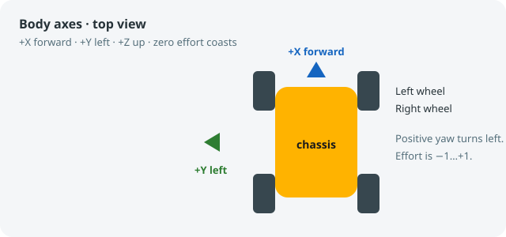
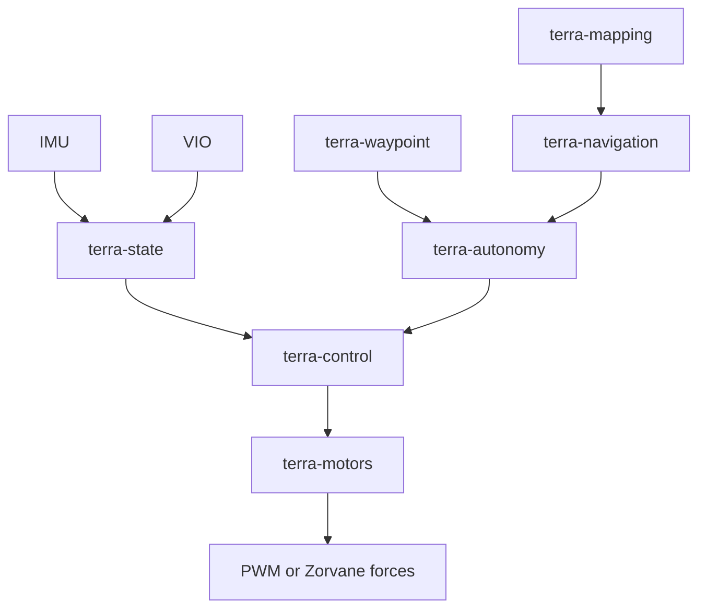
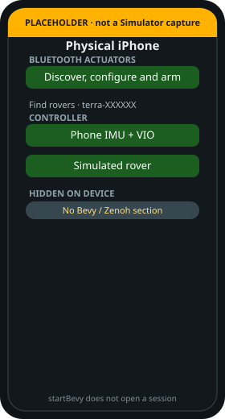
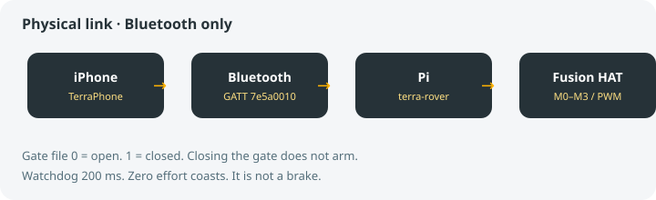
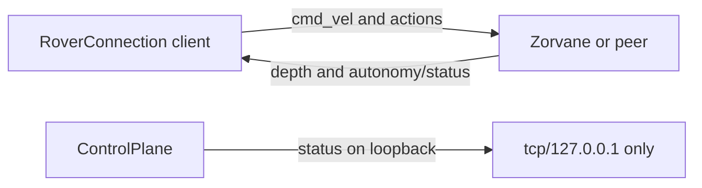
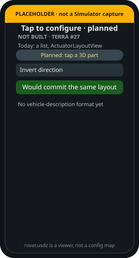

# Architecture

!!! tip "TL;DR"
    ARGOS decides. Terra drives. Zorvane pretends to be the world.
    Onboard loop: IMU and VIO, then a velocity PI, then left and right effort.
    Zero effort coasts. It does not brake.

*Every crate uses these axes. Timestamps are seconds on one clock.*

*Onboard loop. The Pi does not link these crates. It speaks Bluetooth in Python.*

## Two phone builds

{ width="260" }

*Not a Simulator capture. No Xcode in this docs build. Labels match `ContentView`.*

| Target | Zenoh to Zorvane | Bluetooth |
| --- | --- | --- |
| iOS Simulator | Shown. Default `tcp/127.0.0.1:7447`. | Hidden. No radio. |
| iPhone | Hidden. Saved endpoint is deleted. | Shown. Path to a rover. |

`#if targetEnvironment(simulator)` chooses the section. There is no setting that turns Zenoh on for an iPhone.

**Simulated rover** is a motor plant inside the app. It is on both targets. It is not Zorvane.

{ width="260" }

*Device build. Bevy controls are compiled out.*

## Pi and Zenoh

*Customer pairing uses the USR button. Arming is a later step.*

*`RoverConnection` is the Simulator client. `ControlPlane` refuses every address except loopback.*

## Planned

{ width="260" }

*#27 is not built. `rover.usdz` orbits and zooms. It does not edit actuators.*
