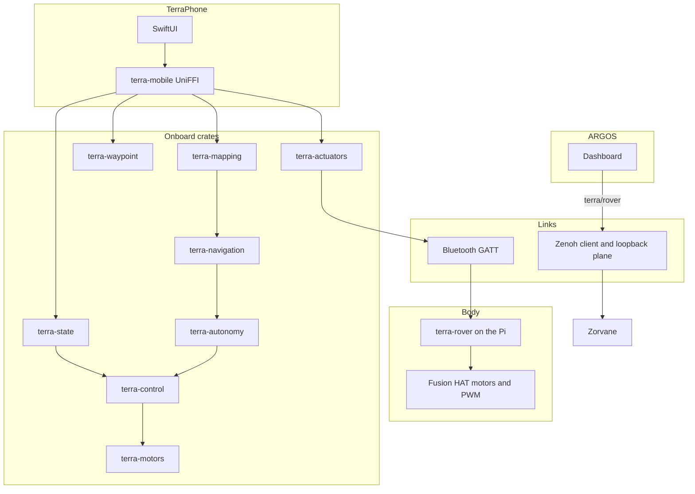

# Architecture

Terra owns the body and the onboard loop. ARGOS decides what the fleet should do. Zorvane stands in for the world when there is no rover on the bench.

## Onboard velocity loop

Body axes are +X forward, +Y left, +Z up. Timestamps are seconds on one monotonic clock.

1. `terra-state` anchors velocity on a VIO sample and integrates IMU only until the next VIO update.
2. `terra-control` runs a differential-drive PI controller with feedforward, coupled effort limits, and back-calculation anti-windup.
3. The result is a `MotorOutput`: signed left and right effort in `[-1, 1]`. Positive effort is forward. Zero is coast, which leaves the chassis free to roll.
4. `terra-motors` turns that effort into PWM duty and direction, after a hardware-enable gate and a command watchdog. The crate does not toggle GPIO.

`terra-waypoint` turns one lat/lon or local goal into the forward velocity and yaw rate that step 2 consumes. `terra-navigation` can reshape that twist so it stays inside observed free space. `terra-autonomy` chooses which source is allowed to command: teleop, assisted teleop, waypoint, or supervised frontier proposals.

## Two phone links, chosen at compile time

`ContentView` and `PhoneController` use `#if targetEnvironment(simulator)`. `TerraPhoneApp` clears a saved Bevy endpoint on a device launch. There is no setting that shows the simulator section on an iPhone.

| Target | Bevy simulator, Zenoh | Bluetooth actuators |
| --- | --- | --- |
| iOS Simulator | Shown. Default endpoint `tcp/127.0.0.1:7447`. Publishes `cmd_vel` and subscribes to that rover's depth camera. | Hidden. The Simulator has no Bluetooth radio. |
| Physical iPhone | Hidden. Launch deletes stored `zenohEndpoint` and `zenohRoverID`. `startBevy` does not open a session. | Shown. This is the path to a rover. |

**Simulated rover** in the Controller section is a local motor plant inside the phone. It is available on both targets. It is separate from the Zorvane process.

Details and the issue that specified the split: [Simulator and iPhone](phone/simulator.md).

## Pi body

The Pi process is Python, packaged as a Nuitka ARM64 executable (`terra-rover` 0.2.0). It speaks the same Bluetooth layout protocol the phone sends. It does not link the Rust crates. `terra-actuators` is the portable Rust validator the phone uses before staging a layout; the Pi package validates layouts again in `terra_rover`.

Customer enrollment is one long press of the Fusion HAT USR button, a 60-second Just Works window, and the advertised name `terra-XXXXXX`. Motor outputs stay unavailable during enrollment. Arming is a later, explicit step, and a physical gate file (or the separately enabled bench mode) has to allow motion. See [Install on a Pi](hardware/INSTALL.md) and [Bluetooth pairing](phone/bluetooth.md).

## Zenoh roles inside Terra

`terra-transport` has two sessions, and they are not interchangeable:

- `RoverConnection` is a TCP **client**. TerraPhone uses it, in the Simulator only, to publish `terra/rover/<id>/cmd_vel` and subscribe to `camera/depth` and `autonomy/status`.
- `ControlPlane` is a **loopback listener**. `listen` rejects any endpoint that does not start with `tcp/127.0.0.1:`. The phone hosts it with `MobileController.host_dashboard` and publishes status, pose, and occupancy there.

ARGOS and Zorvane are the other Zenoh peers. Topic names are listed in [Zenoh](zenoh.md).

## Simulation boundary

Zorvane runs the world, cameras, physics, and its Zenoh bridge. Terra keeps the follower, mapper, planner, and arbiter those components call. `TERRA_*` variables still select the fleet, tiles, mission, and listen address. `TERRA_ZENOH_LISTEN` defaults to `tcp/127.0.0.1:7447`.

## Planned

- Tap a part on the 3D model to edit that actuator, plus a description format that names those parts ([Terra #27](https://github.com/Super-Yojan/Terra/issues/27)). The bundled `rover.usdz` is a viewer model. Tapping it does not configure hardware.
- Zenoh fleet/state and RGB subscriptions, and a reconnection UI, in the transport client.
- A phone control endpoint on anything other than loopback. The autonomy guide records that LAN exposure was rejected and remains a separate decision.
