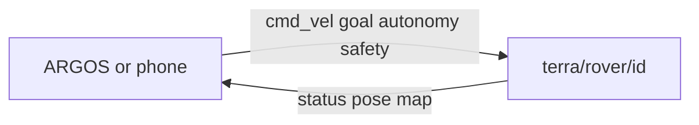

# Autonomy contract, version 1

!!! tip "TL;DR"
    Prefix `terra/rover/<id>`.
    JSON requests, at most 2048 bytes.
    Unknown fields are rejected.

*Level names on the autonomy key.*

*Keys hang off `terra/rover/<id>/`.*

Per-rover prefix: `terra/rover/<id>`. Requests are JSON, at most 2048 bytes, finite numeric values, with unknown fields rejected by control codecs. Token alphabet: 1–64 ASCII alphanumeric characters or `. _ : -`. A bounded 128-request token cache prevents replay; reboot starts a new run identity. Proposal decisions are run-scoped. Dashboard cache and held input reset on a new run. Stops are protected from queue eviction and dominate a control tick.

| Topic | Request/state |
|---|---|
| `autonomy` | `{"level":"teleop","token":"request-1"}`. Also `assisted_teleop`, `waypoint`, `supervised`. |
| `autonomy/status` | Run ID, assigned/requested/effective level, active source, safety/reason, revision, last token/result/request_reason, supported levels, paused. Effective level is null during a hold. |
| `teleop` | `{"linear":1,"angular":0,"operator_session_id":"session-1","sequence":1,"run_id":"run-1","authority_revision":1}`. Metadata is optional for legacy clients. ARGOS sends session/sequence plus run ID/authority revision on every packet, including zero. Paired session/sequence values reject reordered packets; run/authority metadata rejects delayed motion across restart or takeover. Receive lease 500 ms; bounded speed/yaw. |
| `cmd_vel` | Deprecated two-field alias for the leased operator inbox; never bypasses authority. |
| `goal` / `goal/status` | Existing local/WGS84/cancel contract. Rejection receipt appears in autonomy status. Goals do not select autonomous authority. |
| `goal/proposal` | Run ID, proposal ID, local target, originating map revision, expiry in the run clock, reason; null means none. |
| `goal/decision` | `{"run_id":"run-1","proposal_id":1,"decision":"approve","token":"decision-1"}`; also reject. Resume has run ID/decision/token without proposal ID. Approval revalidates current reachable free space; it need not match an unchanged map revision. |
| `safety` | `{"action":"stop","token":"stop-1"}` or guarded reset. |
| `experiment/status` | Run ID, schema version, run-relative elapsed time, UTC sample, recording state. |
| `mission/status` | Objective, phase, budget, boundaries, confirmed/required count and observed survivor locations. Hidden targets are excluded. |
| `mission/report` | `{"survivor_id":1,"token":"report-1"}` confirms an observation belonging to that rover. Confirmation is reflected in mission status. |
| `pose` | Phone direct pose: rover_id, sequence, x/y metres and yaw radians. Simulator also supplies exposure-aligned depth pose. |

State is retained in application memory and republished periodically, not dependent on Zenoh storage/history. Simulator status is emitted on transitions and at 5 Hz; the loopback phone service republishes at 10 Hz. Fleet takeover/stop use per-rover commands and receipts; they are not atomic. A network publication is not an acknowledgement. No automatic replay on reconnect.

Waypoint cancel enters teleop.
Supervised cancel pauses exploration; resume or a new operator target is required.
Reset never restores an old goal/lease.
Planner footprint defaults to a 0.65 m circumscribed radius for the simulated 0.9 × 0.8 m chassis, 2 m/s and 2 rad/s caps, 1 m/s² acceleration/braking, 2 rad/s² yaw acceleration, and 2 s rollout.
Planning runs at up to 10 Hz while the motor loop remains independent.
These configuration values require physical calibration before real robot trials.

## Observed occupancy telemetry

Both simulator and phone publish `<prefix>/<rover_id>/map/occupancy` at no more than 5 Hz from their observed local map. JSON fields: `schema_version: 1`, `rover_id`, `run_id`, `sequence` (map revision), `width`, `height`, `resolution` (metres), `origin_x`, `origin_y`, and `occupancy`.

Cells are row-major: index `row * width + column`, columns increase world +X, rows increase world +Y. The origin is the minimum XY cell corner. Values are -1 (unknown) and 0–100 (occupancy probability). ARGOS renders values below 65 as free and values at least 65 as occupied, matching the navigation threshold. The packet contains observed cells, not private mission targets or ground-truth obstacle geometry. A repeated revision is not a new observation; freshness comes from the last increasing revision received by ARGOS.

## L4 target-search extension

The additive `target_search` level and versioned `/search`, `/search/action`, `/search/status`, `/search/report` and `/search/report/ack` topics are documented in [TARGET_SEARCH.md](TARGET_SEARCH.md). The existing `supervised` mode retains its proposal approval semantics. Capability advertising requires a registered, fresh detector; physical recognition remains unavailable until an adapter is supplied and validated.
