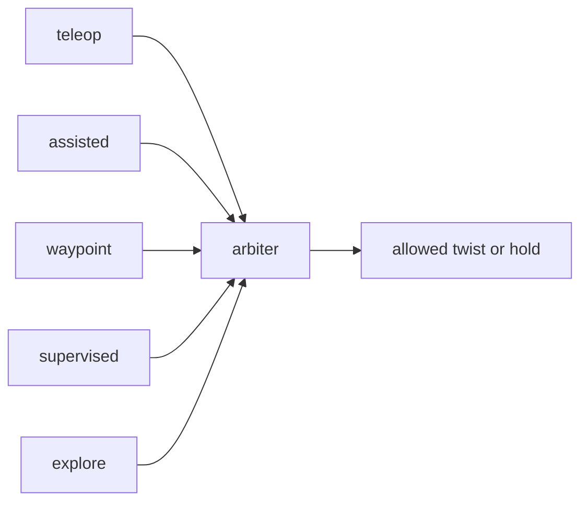

# Mission autonomy

!!! tip "TL;DR"
    Five levels share one arbiter.
    Stop latches until reset.
    The reference mission runs in Zorvane, not in this repo.


*teleop, assisted teleop, waypoint, supervised, and autonomous explore.*



*One arbiter. Effective level is empty during a stop.*

The runtime answers a mission question: which level of operator support is sufficient to finish a task safely under the conditions being tested? It does not automatically choose an optimal level.

Run the reference disaster-search scenario from a [Zorvane](https://super-yojan.dev/Zorvane/) checkout. The arbiter crates stay in Terra. The Zenoh prefix stays `terra/rover`, and the `TERRA_*` variables still select the mission:

```sh
TERRA_MISSION=1 TERRA_MISSION_SEED=42 TERRA_ROVER_COUNT=2 cargo run -p zorvane
```

For background rendering and automated local checks, add `TERRA_HEADLESS=1`; the depth renderer still runs.

The seeded world contains broken walls, a chokepoint, rubble, and alternate open routes.
The mission requires finding three simulated survivors, confirming their observed locations, and returning the observing rovers within 2 m of the origin before 600 seconds.
Locations are private simulator ground truth until a rover is within 5 m and the complete occupancy ray to the target is observed free.
These are simulated detection rules, not a validated human-detection sensor model.
Mission obstacles and rover maps are separate from hidden targets.


Connect native ARGOS to `tcp/127.0.0.1:7447`. Explicitly choose a level before sending a waypoint:

- Teleop: hold keyboard/touch controls for precise movement. Commands expire after 500 ms.
- Assisted teleop: operator intent goes through the shared obstacle/braking checker.
- Waypoint: operator-selected targets use the shared follower and local planner.
- Supervised: reachable frontier targets are proposed; approval is required before motion. Reject, redirect, cancel/pause, or take over as mission conditions require.
- Explore: the same frontiers are goals immediately. There is no per-goal approval. The run stops when the budget ends, no frontier remains, the operator stops or takes over, or the map or safety hold ends it.

## Start an exploration run

Publish on `terra/rover/<id>/autonomy`. Use seconds or minutes, not both:

```json
{"level":"explore","token":"explore-1","budget_seconds":180}
```

```json
{"level":"explore","token":"explore-2","budget_minutes":5}
```

The rover must already have a fresh pose and occupancy map. The budget clock starts on the next arbiter step. TerraPhone has an **Autonomous explore** level and an explore-budget field. In process code, `set_exploration_budget(180.0)` lets a later level request omit the budget.

Stop the run with any of these:

- `{"level":"teleop","token":"take-1"}` on `autonomy` (takeover)
- `{"action":"stop","token":"stop-1"}` on `safety`
- `{"cancel":true}` on `goal`

`terra/rover/<id>/exploration/status` reports elapsed and remaining time, the current target, observed free area, and `end_reason`. The same object is nested in `autonomy/status` under `exploration`. While the run is moving, `active_source` is `explore`.

Run logs stay JSONL via `RunRecorder`. Each control tick already stores `events`. Exploration adds `exploration_started`, `frontier_selected`, `frontier_blocked`, `exploration_progress` (coverage, elapsed, remaining about once a second), `exploration_ended`, and `detection_reported`. TerraPhone also stores the status object on the tick. Summarize with `terra-run-summary` as before.

Zorvane applies the twist from the arbiter as soon as it depends on this crate. It already forwards `autonomy` and serializes `autonomy/status`, so the nested `exploration` object appears without a bridge change. To publish the dedicated key, add this next to the other status puts in `drive_autonomy`:

```rust
(
    "exploration/status",
    serde_json::to_value(&output.exploration).unwrap(),
),
```

And include `"exploration": output.exploration` on the `control_tick` record. Phase 2 can call `arbiter.notify_detection` when a simulated survivor is observed. `FindTargetsObjective` is the stub. It is not a detector.

Safety holds, requested/effective authority, and the assigned trial condition are distinct.
A takeover clears old goal and teleop intent, including when already in teleop.
Emergency stop remains latched until a healthy explicit reset.
Space in Zorvane latches emergency stop; release alone does not reset it.
Keyboard release, focus loss, changing selected rover, and connection loss revoke dashboard driving intent.
Fleet actions fan out independently; unacknowledged targets are not reported as stopped.


## Trial design and logs

`TERRA_TRIAL_DESIGN=fixed` with `TERRA_ASSIGNED_LEVEL=waypoint` records a fixed assigned condition. `TERRA_TRIAL_DESIGN=adaptive` records operator-selected switching. Assigned conditions remain unchanged on takeover; actual requests/effective levels are recorded separately. The assigned variable labels the trial, not a lock preventing emergency intervention. Balance trial order and use multiple recorded scenario seeds in the study protocol; this implementation does not infer causality or an optimal policy from a single run.

Zorvane writes run logs to `simulator/runs` relative to that process, or to `TERRA_RUN_DIR` when it is set. They contain the mission definition, planner configuration, run identity, control outputs, authority/request events, mission progress, observed free area, contacts, and clearance-based near-miss episodes. Contact observations exclude the ground. Observed free area is a map-observation measure, not proof that every cell was searched for survivors. Summarize a JSONL log from this Terra checkout with:

```sh
cargo run -p terra-experiment --bin terra-run-summary -- /path/to/<run-id>.jsonl
```

A complete recording and successful mission are separate results. Truncated or failed recordings are not complete-data runs. Near misses start below 0.3 m observed clearance and end above 0.4 m; unavailable phone contact sensing is labelled unavailable, never zero collisions. Interaction counts and active control time are workload proxies, not measured subjective workload.

TerraPhone uses the same arbiter through UniFFI, records sandbox JSONL files, and supports mode/stop/proposal controls and share/export.
Remote-supervisor mode sends goals and control intent to Zorvane instead of running another phone waypoint controller for it.
Depthless devices hold levels needing maps.
The optional Rust phone control endpoint currently accepts loopback addresses only: LAN exposure was rejected by automatic approval review and remains a separate approval/security-boundary decision.
Physical device navigation, braking calibration, and real survivor detection are not inferred from Zorvane or Xcode build results.


ARGOS exports operator JSONL sessions. Join action tokens and teleop session/sequence values to rover receipts; do not count both ends as two interventions. `/experiment/status` provides run identity and paired run-time/UTC samples. Clock offsets and network uncertainty must be retained rather than treating two machines' monotonic clocks as interchangeable.
