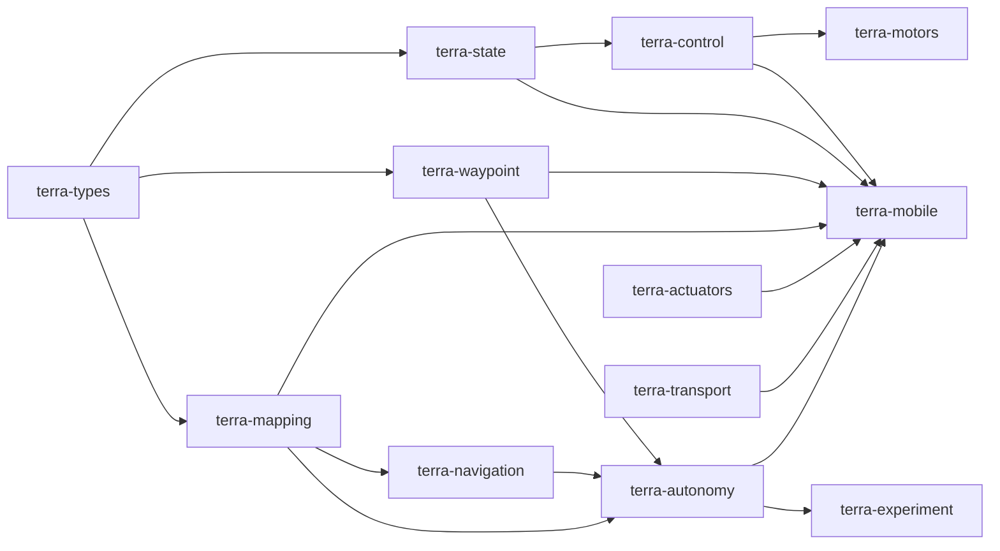

# Crates

The Cargo workspace is the onboard stack. `terra-mobile` is the UniFFI boundary TerraPhone links. The other crates stay free of UniFFI so Zorvane and tests can use them directly.

Generated rustdoc for every workspace crate, built with `cargo doc --no-deps`, is published at [super-yojan.dev/Terra/api/](https://super-yojan.dev/Terra/api/).

| Crate | Role |
| --- | --- |
| [terra-types](terra-types.md) | SI samples, body axes, velocity commands, motor effort, health. |
| [terra-state](terra-state.md) | VIO-anchored velocity with bounded IMU prediction. |
| [terra-control](terra-control.md) | Differential-drive velocity PI, feedforward, anti-windup. |
| [terra-waypoint](terra-waypoint.md) | One lat/lon or local goal, followed as a body twist. |
| [terra-transport](terra-transport.md) | Zenoh client for `cmd_vel` and depth, plus a loopback control plane. |
| [terra-mapping](terra-mapping.md) | Rolling local occupancy grid from axial depth. |
| [terra-navigation](terra-navigation.md) | Local planner, frontier search, observed clearance. |
| [terra-autonomy](terra-autonomy.md) | Four authority levels, safety hold, proposals. |
| [terra-experiment](terra-experiment.md) | JSONL run logs, mission observations, summaries. |
| [terra-motors](terra-motors.md) | Effort to PWM, enable gate, watchdog, software bench sequence. |
| [terra-actuators](terra-actuators.md) | Portable layouts, routing, Bluetooth framing. |
| [terra-mobile](terra-mobile.md) | UniFFI objects the iOS app calls. |

The Pi service does not depend on these crates. It reimplements the Bluetooth layout protocol in `hardware/raspberry-pi/terra_rover/`.
