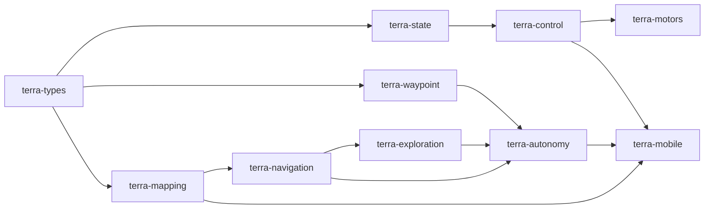

# Crates

!!! tip "TL;DR"
    Thirteen workspace crates.
    `terra-mobile` is the only UniFFI boundary.
    The Pi reimplements Bluetooth in Python. It does not link these crates.

*Phone and Zorvane share the middle. PWM stays in `terra-motors`.*

*+X forward, +Y left, +Z up.*

| Crate | One line |
| --- | --- |
| [terra-types](terra-types.md) | Samples, axes, effort. |
| [terra-state](terra-state.md) | VIO anchor, short IMU prediction. |
| [terra-control](terra-control.md) | Differential PI. |
| [terra-waypoint](terra-waypoint.md) | One goal, one twist. |
| [terra-transport](terra-transport.md) | Zenoh client and loopback plane. |
| [terra-mapping](terra-mapping.md) | Rolling occupancy grid. |
| [terra-navigation](terra-navigation.md) | Local planner and supervised frontiers. |
| [terra-exploration](terra-exploration.md) | Time-bounded autonomous exploration. |
| [terra-autonomy](terra-autonomy.md) | Five levels and a safety hold. |
| [terra-experiment](terra-experiment.md) | JSONL logs and summaries. |
| [terra-motors](terra-motors.md) | PWM, enable, watchdog, coast. |
| [terra-actuators](terra-actuators.md) | Layouts and Bluetooth frames. |
| [terra-mobile](terra-mobile.md) | Swift exports. |

Rustdoc: [super-yojan.dev/Terra/api/](https://super-yojan.dev/Terra/api/).
