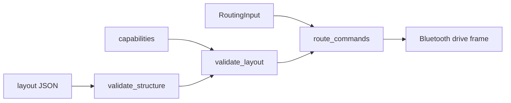

# terra-actuators

!!! tip "TL;DR"
    Layout JSON in. Normalized actuator values out.
    This crate does not arm and does not invert.
    PWM presets stay invalid until you replace `SELECT_*_PWM_PORT`.

*The phone validates here. The Pi validates again in Python.*

[API](https://super-yojan.dev/Terra/api/terra_actuators/index.html) · [readme](https://github.com/Super-Yojan/Terra/blob/main/crates/terra-actuators/README.md)

*Unidirectional ESC inversion is rejected. That channel cannot reverse.*

## Fusion HAT pins

| Motor | Pins | Rate |
| --- | --- | --- |
| M0 | P11 P10 | 100 Hz |
| M1 | P9 P8 | 100 Hz |
| M2 | P6 P7 | 100 Hz |
| M3 | P4 P5 | 100 Hz |

Pulse outputs are 50 Hz. Timer groups are P0–P3, P4–P7, P8–P11. Do not mix 100 Hz and 50 Hz in one group.

Presets: [`presets/`](https://github.com/Super-Yojan/Terra/tree/main/crates/terra-actuators/presets).

Positive yaw turns left when the left coefficient is negative and the right coefficient is positive.

{ width="240" }

*Tap-to-configure is planned. This screen is the list that exists.*
