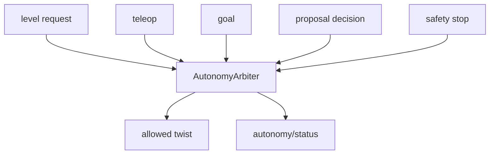

# terra-autonomy

!!! tip "TL;DR"
    Five levels. The arbiter does not pick a favorite.
    Stop latches until a healthy reset.
    Reset does not restore the old goal.

*Effective level is empty during a hold.*

[API](https://super-yojan.dev/Terra/api/terra_autonomy/index.html) · [contract](../autonomy/PROTOCOL.md) · [mission](../autonomy/README.md)

*Tokens are 1–64 characters from letters, digits, and `. _ : -`.*

| Level | Motion |
| --- | --- |
| `teleop` | Held input. It expires. |
| `assisted_teleop` | Held input, after the obstacle check. |
| `waypoint` | One operator goal. |
| `supervised` | A frontier. Wait for approval. |
| `explore` | Frontiers until the budget, with no approval. |

`occupancy_telemetry` publishes observed cells only. Hidden mission targets stay out of the packet.

`explore` executes each frontier as a waypoint through this arbiter. See [terra-exploration](terra-exploration.md) and [how to start a run](../autonomy/README.md#start-an-exploration-run).

Run the reference search in Zorvane with `TERRA_MISSION=1`.
