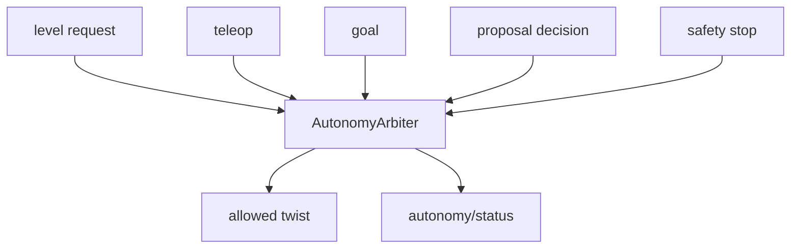

# terra-autonomy

!!! tip "TL;DR"
    Four base levels plus capability-gated target search. The arbiter does not pick a favorite.
    Stop latches until a healthy reset.
    Reset does not restore the old goal.

*Effective level is empty during a hold.*

[API](https://super-yojan.dev/Terra/api/terra_autonomy/index.html) · [contract](../autonomy/PROTOCOL.md) · [mission](../autonomy/README.md)

*Tokens are 1–64 characters from letters, digits, and `. _ : -`.*

| Level | Motion |
| --- | --- |
| `teleop` | Held input. It expires. |
| `assisted_teleop` | Held input, after the obstacle check. |
| `waypoint` | One operator goal. |
| `supervised` | A frontier. Wait for approval. |
| `target_search` | Autonomous exploration and observed target confirmation. Requires a detector. |

`occupancy_telemetry` publishes observed cells only. Hidden mission targets stay out of the packet.

Run the reference search in Zorvane with `TERRA_MISSION=1`.

See [L4 target search](../autonomy/TARGET_SEARCH.md) for lifecycle, reporting and platform scope.
