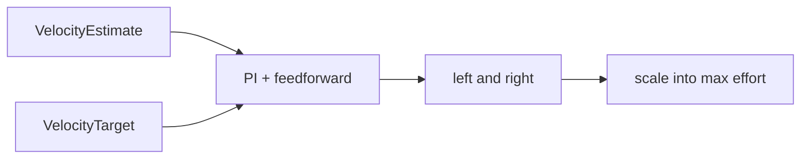
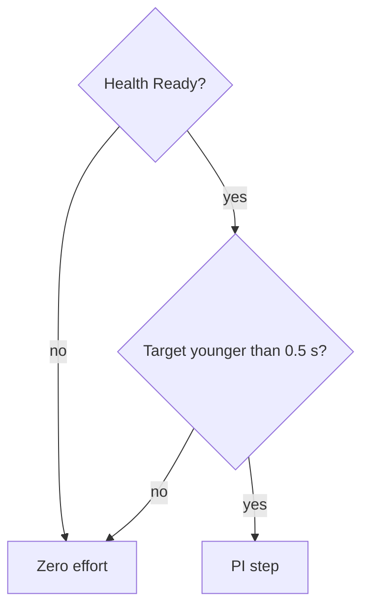

# terra-control

!!! tip "TL;DR"
    PI on forward speed and yaw rate.
    Mix: left = linear − yaw, right = linear + yaw.
    Target older than 0.5 s stops the output.

*Positive yaw puts more effort on the right wheel. The vehicle yaws left.*

[API](https://super-yojan.dev/Terra/api/terra_control/index.html) · [source](https://github.com/Super-Yojan/Terra/blob/main/crates/terra-control/src/lib.rs)

## Defaults that matter

| Knob | Value |
| --- | --- |
| `max_forward`, `max_yaw_rate` | 2 m/s, 2 rad/s |
| `target_timeout` | 0.5 s |
| `max_step` | 0.1 s |
| `max_effort` | 1 |

*The motor watchdog is a different timer: 0.2 s in `terra-motors`.*

A settled zero target and a near-zero estimate clear the integrators.
