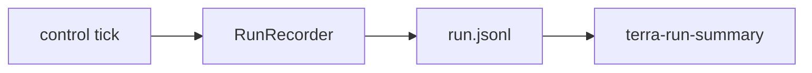
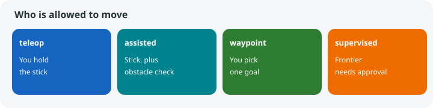

# terra-experiment

!!! tip "TL;DR"
    One JSON object per line.
    A complete file and a finished mission are different facts.
    Near miss: closer than 0.3 m, clear above 0.4 m.



*Zorvane writes under `simulator/runs`, or `TERRA_RUN_DIR`.*

[API](https://super-yojan.dev/Terra/api/terra_experiment/index.html) · [source](https://github.com/Super-Yojan/Terra/tree/main/crates/terra-experiment/src)

```sh
cargo run -p terra-experiment --bin terra-run-summary -- /path/to/run.jsonl
```



*Join ARGOS operator logs on the action token. Do not count both ends as two interventions.*

`MissionConfig::rescue` looks for three simulated survivors. That rule is not a person detector.

Missing clearance is unavailable. It is not stored as zero collisions.
