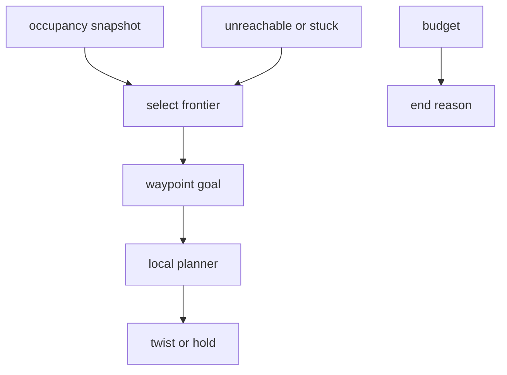

# terra-exploration

!!! tip "TL;DR"
    Explores until a time budget ends.
    Picks frontiers. Does not touch motors.
    The arbiter still drives through the local planner.

*Unknown cells are not free. A frontier is a free cell beside unknown space.*

[API](https://super-yojan.dev/Terra/api/terra_exploration/index.html) · [source](https://github.com/Super-Yojan/Terra/tree/main/crates/terra-exploration/src)

*No approval step. Supervised mode is unchanged and still waits.*

| End reason | When |
| --- | --- |
| `budget_expired` | Elapsed time reached the budget. |
| `no_frontiers_left` | No reachable unknown edge remains, including after retries are exhausted. |
| `operator_stop` | Safety stop, or a goal cancel while exploring. |
| `operator_takeover` | Level changes away from `explore`. |
| `map_stale` | The map is missing or older than 0.5 s. |
| `safety_hold` | Pose or health is not fresh. Emergency stop uses `operator_stop`. |
| `objective_complete` | Phase 2 stub. A caller reported a wanted detection. |

A blocked frontier is blacklisted. Another frontier is chosen on the next tick. After `max_attempts` (default 3) that point stays out for the rest of the run. A single blocked planning tick does not drop the goal. The default stuck window is 5 s.

`MissionObjective` and `GoalScorer` are the phase 2 hooks. `TimeBudgetObjective` and `InformationGainScorer` are the defaults. `FindTargetsObjective` records labels such as `survivor` and can end the run. This crate does not classify images.

Coverage is the area of observed free cells (occupancy 0–64), in square metres. `explored_ratio` is the fraction of cells that are no longer unknown.

While `explore` is active the arbiter caps the local-planner horizon at `approach_horizon` (default 1 s). Unknown cells stay blocked. The shorter lookahead is what lets a goal on the edge of the map be reached. Occupied cells still stop the rover.
