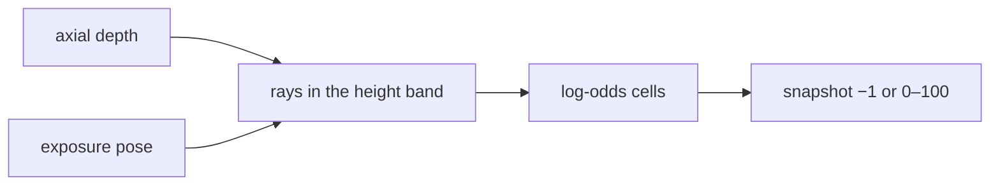

# terra-mapping

!!! tip "TL;DR"
    A 20 m × 20 m grid.
    Cells are 10 cm.
    Depth is axial Z, not ray length.
    −1 means unknown.


*Call `clear()` when localization resets. Evidence does not decay.*

[API](https://super-yojan.dev/Terra/api/terra_mapping/index.html) · [readme](https://github.com/Super-Yojan/Terra/blob/main/crates/terra-mapping/README.md)



*Hits beat free marks in the same frame. Cells behind an obstacle stay unknown.*

Obstacle band: 0.15 m to 2.0 m. Range cap: 15 m. `pixel_stride` is 4.

Phone simulated mode invents room depth. ARKit mode assumes the camera is 0.5 m up. Zenoh mode uses the published camera height instead.

```sh
cargo test -p terra-mapping
cargo run -p terra-mapping --example wall
```
