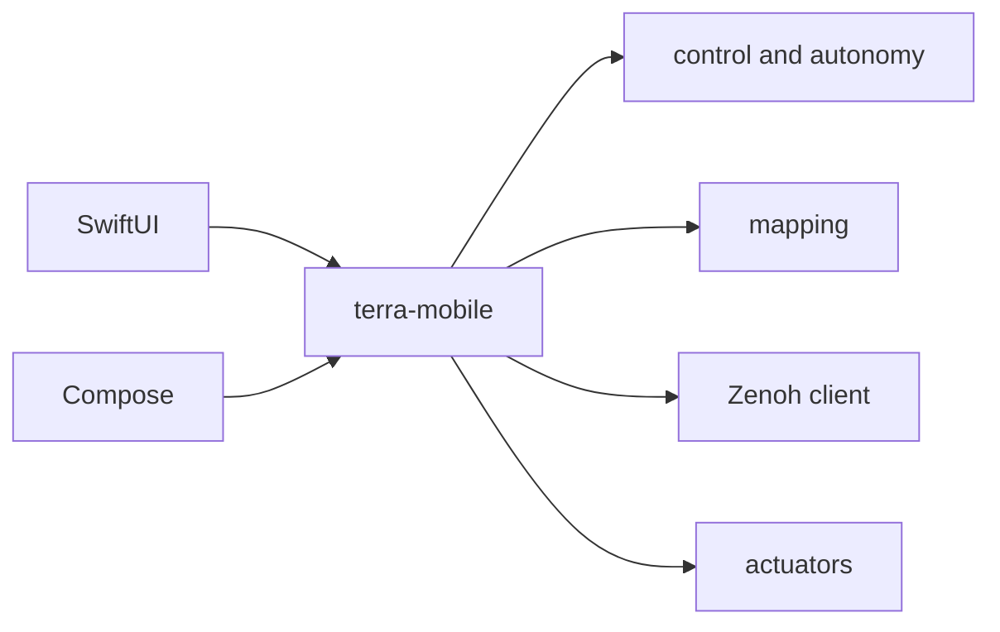

# terra-mobile

!!! tip "TL;DR"
    UniFFI boundary for TerraPhone.
    Other crates stay free of UniFFI.
    Swift bindings are generated on a Mac. Kotlin bindings are generated by `scripts/build-android.sh`.
    Neither binding is committed.



*[Build steps](../phone/build.md). Deployment target is iOS 17.*

[API](https://super-yojan.dev/Terra/api/terra_mobile/index.html)

| Swift name | Rust |
| --- | --- |
| `MobileController` | Estimator, PI, arbiter, recorder. |
| `MobileWaypoint` | `terra-waypoint`. |
| `MobileOccupancyMap` | `terra-mapping`. |
| `MobileZenohClient` | `RoverConnection`. Simulator path. |
| `host_dashboard` | Loopback `ControlPlane`. |
| `actuator_route` | `route_commands`. |

{ width="240" }

*Placeholder. The real view is SwiftUI in `ContentView`.*

When the dashboard is open, ticks can publish `autonomy/status`, `goal/status`, `map/occupancy` (at most every 0.2 s), and `pose`.

```sh
./scripts/build-ios.sh
./scripts/check-swift.sh
./scripts/build-android.sh
```

Android steps are in [TerraPhone for Android](../MOBILE_ANDROID.md).
