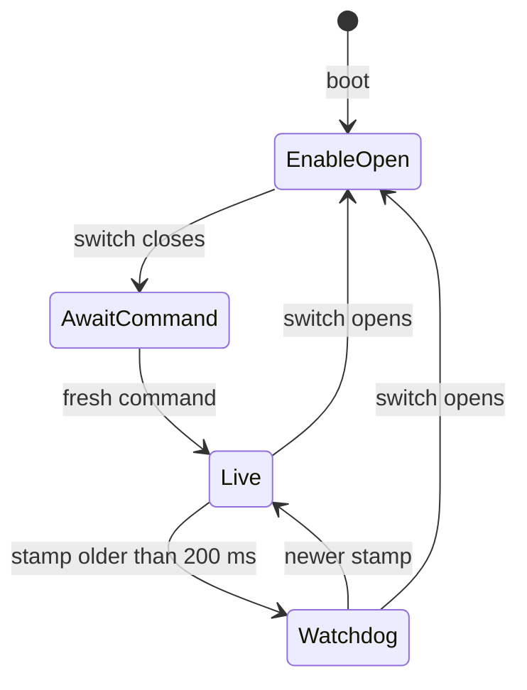
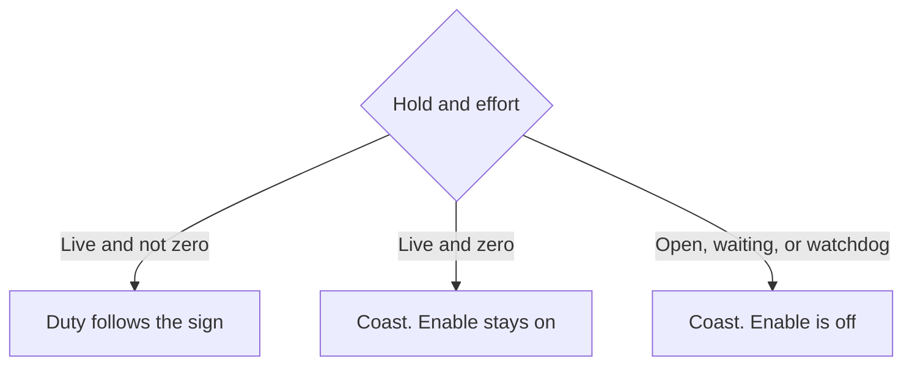

# terra-motors

!!! tip "TL;DR"
    Signed effort becomes PWM duty and a direction.
    Boot assumes the enable switch is open.
    Closing the switch does not replay the last command.
    Default watchdog is 200 ms. Zero effort coasts.



*EnableOpen, AwaitCommand, and Watchdog all coast. Watchdog also drops driver enable.*

[API](https://super-yojan.dev/Terra/api/terra_motors/index.html) · [readme](https://github.com/Super-Yojan/Terra/blob/main/crates/terra-motors/README.md)

## Coast versus PWM



*Coast is duty 0 and both bridge inputs low. It is not a brake.*


*Positive effort is forward. `in1_in2` keeps at most one input high.*

`drive_enabled` is the chip EN or nSLEEP line. If that chip brakes when disabled, the brake belongs to the chip.

## Software bench

`software_bench_sequence` runs the wheels-up story with no power.

```sh
cargo test -p terra-motors software_bench_sequence
```

1. Switch open. `+1` and `−1` stay `EnableOpen`.
2. Close the switch. Hold is `AwaitCommand`. Nothing replays.
3. Left `+0.5`, right `−0.25`. Left bridge `(0.5, 0)`. Right `(0, 0.25)`.
4. A fresh zero stays `Live` and coasts.
5. After the timeout, `poll` is `Watchdog`.
6. A new stamp may drive again.
7. Opening the switch forces `EnableOpen` even if the command is fresh.

## Wheels off the ground

Same seven steps, with a driver attached and the chassis in the air.

No radio stack. Logic power until enable is proven.

The hardware switch must kill motor power even if this process dies.

Phone sensing plus this adapter has not been validated on a rover. The Bluetooth bench in [Bench](../hardware/BENCH.md) is a separate checklist and has not been run.
