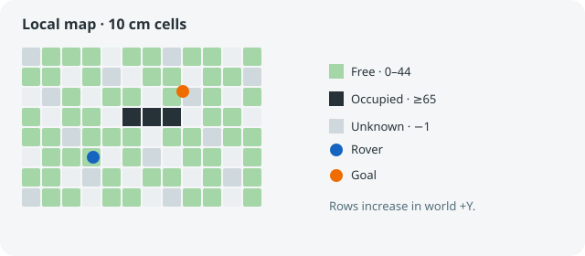
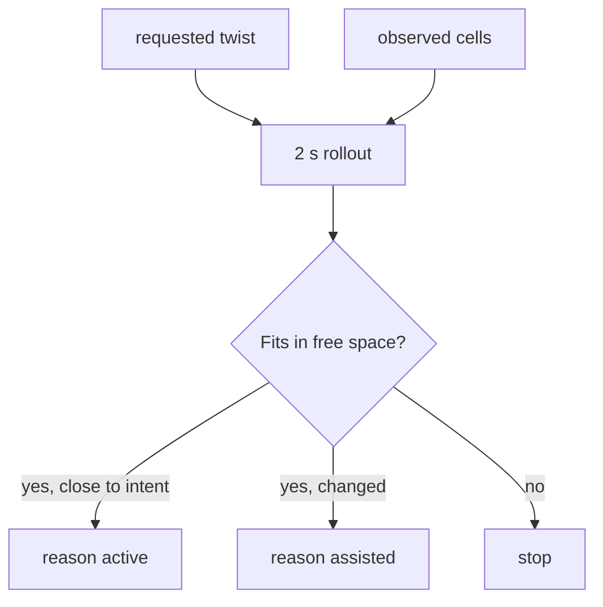

# terra-navigation

!!! tip "TL;DR"
    Plans only on cells the rover has seen.
    Occupied means probability ≥ 65.
    A frontier is a proposal. It does not move the rover by itself.

*Unknown cells are not free. Default footprint radius is 0.65 m.*

[API](https://super-yojan.dev/Terra/api/terra_navigation/index.html) · [source](https://github.com/Super-Yojan/Terra/blob/main/crates/terra-navigation/src/lib.rs)

*Caps: 2 m/s, 2 rad/s, 1 m/s², 2 rad/s² yaw.*

`frontier` searches inflated free cells. `observed_clearance` feeds near-miss logs in `terra-experiment`.
