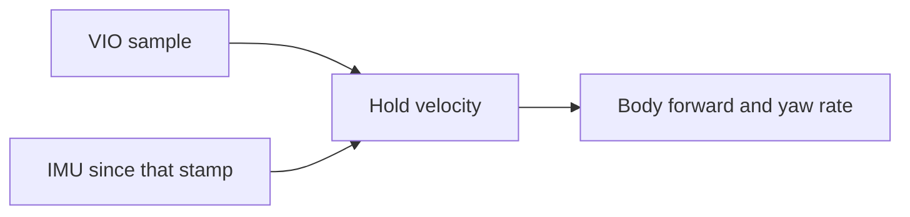

# terra-state

!!! tip "TL;DR"
    VIO anchors velocity.
    IMU fills the gap until the next VIO sample.
    Stale or untracked input reports zero.

*Not a visual-odometry stack. Not a bias EKF.*

[API](https://super-yojan.dev/Terra/api/terra_state/index.html) · [source](https://github.com/Super-Yojan/Terra/blob/main/crates/terra-state/src/lib.rs)

## Timeouts

| Input | Default |
| --- | --- |
| IMU | 0.1 s |
| VIO | 0.35 s |

`vio_timeout` must be at most 2 s.

*`forward` is body X. `yaw_rate` is the latest gyro Z.*

`estimate` returns zero when VIO is missing, tracking is lost, IMU is missing, or either sample is stale.

The IMU buffer keeps 512 samples. Acceleration above 1000 m/s² or spin above 100 rad/s is rejected.
