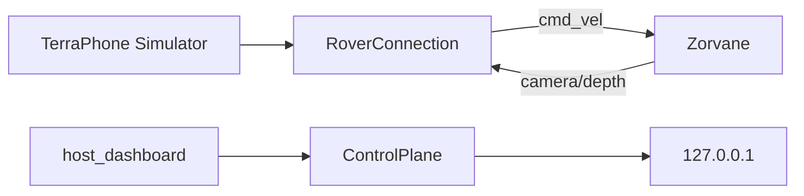

# terra-transport

!!! tip "TL;DR"
    `RoverConnection` is a TCP client. Simulator only.
    It publishes `cmd_vel` at 20 Hz and drops the lease after 250 ms.
    `ControlPlane` listens only on `tcp/127.0.0.1`.



*UDP is rejected. Multicast scouting is off. Connect timeout is 2 s.*

[API](https://super-yojan.dev/Terra/api/terra_transport/index.html) · [readme](https://github.com/Super-Yojan/Terra/blob/main/crates/terra-transport/README.md)

## Client contract

`set_target` allows ±2 m/s and ±2 rad/s.

An invalid target forgets the previous one.

Disconnect publishes a final zero.

`status` means the socket is open. It does not mean the wheels moved.


*Subscribe key: `terra/rover/<id>/camera/depth`. Encoding `32FC1_LE`.*

## Loopback plane

Accepts `autonomy`, `safety`, `goal`, `goal/decision`, `teleop`, and `cmd_vel`.

Publishes `terra/rover/fleet/state` every 100 ms for that one rover id.

```sh
cargo test -p terra-transport -- --ignored
```

RGB, a client fleet subscription, and reconnect UI are planned.
