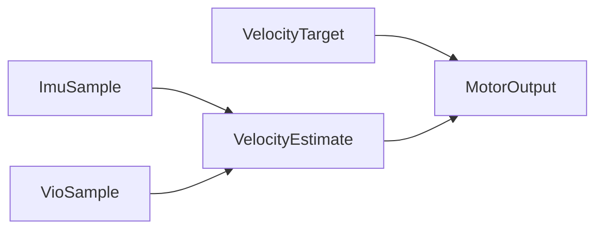

# terra-types

!!! tip "TL;DR"
    Shared geometry and samples.
    Body axes: +X forward, +Y left, +Z up.
    Motor effort is −1…+1. Zero coasts.

*Source of the axes. Later crates do not redefine them.*

[API](https://super-yojan.dev/Terra/api/terra_types/index.html) · [source](https://github.com/Super-Yojan/Terra/blob/main/crates/terra-types/src/lib.rs)

## What you pass around

*One monotonic clock, in seconds.*

| Type | Keep |
| --- | --- |
| `ImuSample` | Gravity-free m/s². Gyro in rad/s. |
| `VioSample` | Pose, world velocity, `tracked`. |
| `VelocityTarget` | `forward` m/s and `yaw_rate` rad/s. |
| `MotorOutput` | `left` and `right` effort. `stop_reason` if neutral. |

`Health` is missing, stale, or untracked sensors.

`InputError` is a bad number, a bad quaternion, or a clock that went backwards.

`Quaternion::rotate` wants a normalized quaternion.
