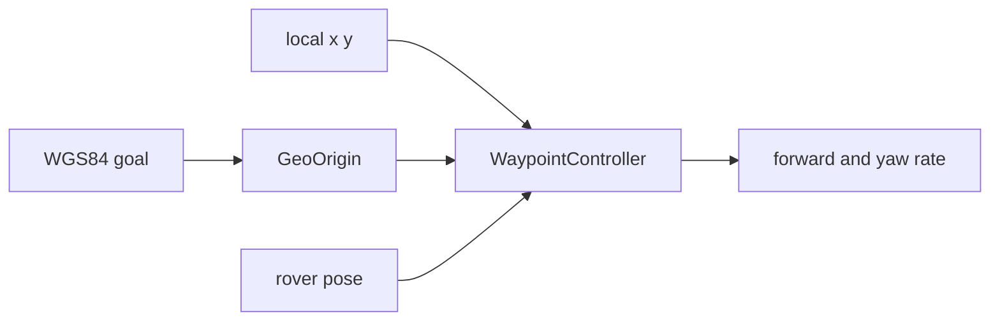

# terra-waypoint

!!! tip "TL;DR"
    One goal in. One body twist out.
    Metres are +x north and +y west.
    Phone and Zorvane call this same follower.

*Cancel is `{"cancel":true}` and nothing else.*

[API](https://super-yojan.dev/Terra/api/terra_waypoint/index.html) · [source](https://github.com/Super-Yojan/Terra/blob/main/crates/terra-waypoint/src/lib.rs)

## Defaults

| Knob | Value |
| --- | --- |
| Cruise | 1 m/s |
| Arrive | 0.75 m |
| Slow down inside | 3 m |
| Max yaw rate | 1.2 rad/s |

*Orange is the goal. Blue is the rover. Phone half-extent is 49 m.*

Default fields: origin `38.8297, -77.3075`. Goal about 12 m north. Token `gmu-north`.

A goal outside `halfExtent` is refused. Latitude must sit in −85…85.
