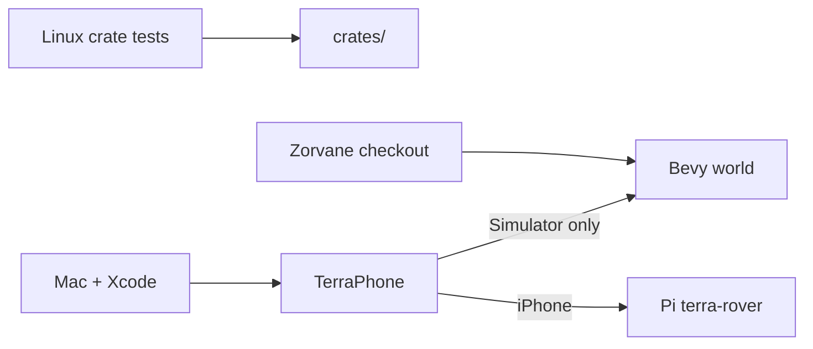

# Getting started

!!! tip "TL;DR"
    Linux: `cargo test --locked --workspace`.
    Mac: `./scripts/build-ios.sh`, then Xcode.
    World: Zorvane, `cargo run -p zorvane`.



*Three machines. The Simulator and the iPhone do not share a link.*

## Rust

```sh
cargo test --locked --workspace
cargo test -p terra-transport -- --ignored
cargo test -p terra-motors
```

Workspace edition is 2024. Crate version is `0.1.0`. The Pi package is `0.2.0`.

The ignored transport test needs local TCP. `software_bench_sequence` does not power a motor.

## Phone

{ width="260" }

*Wireframe only. Build on a Mac with the iOS 17 SDK.*

```sh
rustup target add aarch64-apple-ios aarch64-apple-ios-sim x86_64-apple-ios
./scripts/build-ios.sh
open mobile/ios/TerraPhone.xcodeproj
```

Details: [Building in Xcode](phone/build.md).

## World and Pi

{ width="320" }

*Splash art, not a photo of a bench rover.*

From a [Zorvane](https://super-yojan.dev/Zorvane/) checkout, same Mac as the Simulator:

```sh
TERRA_ZENOH_LISTEN=tcp/0.0.0.0:7447 cargo run -p zorvane
```

Connect the Simulator to `tcp/127.0.0.1:7447`, rover `0`.

Pi install: [Install on a Pi](hardware/INSTALL.md). The [bench](hardware/BENCH.md) is written and not yet run.

## This site

```sh
pip install -r docs/requirements.txt
mkdocs build --strict
```

API docs land at [`/api/`](https://super-yojan.dev/Terra/api/) from `cargo doc --no-deps --locked --workspace`.
