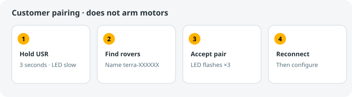
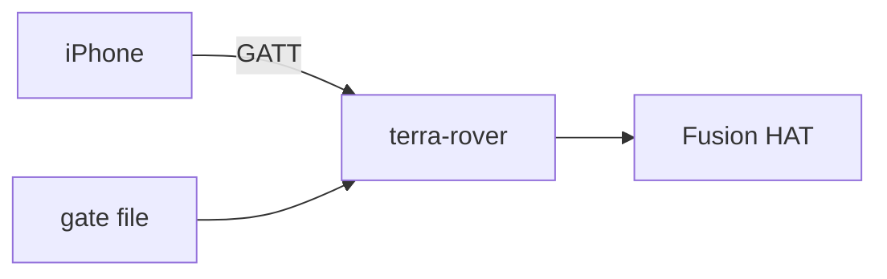

# Bluetooth peripheral

!!! tip "TL;DR"
    Customer path: hold USR, find `terra-XXXXXX`, accept the prompt.
    Developer path: numeric comparison, service stopped.
    Radio behavior is specified here and not yet measured on hardware.



*Enrollment. Motors stay off.*



*Gate closed is not the same as armed.*

## Customer enrollment

The compiled customer service supports one Fusion HAT USR long press to open a
60-second Just Works pairing window. Find the `terra-XXXXXX` name in TerraPhone,
connect and accept pairing. The LED blinks slowly while available, quickly while
enrolling, flashes three times when saved, then stays on. Reconnect in the app;
the Pi switches to normal operation automatically. No SSH or expected peer address
is needed. Existing owners cannot be replaced this way, and motor outputs are
unavailable during enrollment. See [installation and enrollment](INSTALL.md).
The terminal setup instructions below remain a developer alternative.

# Terra Bluetooth actuator peripheral

For the compiled ARM64 executable and boot service, use the
[Raspberry Pi installation guide](INSTALL.md). The source/virtual-environment
examples below remain available for development; use `terra-rover` instead of
`python3 -m terra_rover` with the compiled installation.

These are future deployment instructions, not execution evidence. No installation,
radio session or hardware procedure was performed for this implementation.

From the repository root, create a deployment virtual environment and install the
local package (paths require suitable deployment permissions):

```sh
python3 -m venv /opt/terra/venv
/opt/terra/venv/bin/python -m pip install ./hardware/raspberry-pi
```

`fusion_hat` is deliberately absent from package dependencies: install the exact
reviewed 1.14.0 vendor release separately for real hardware. Mock mode requires no
vendor package but still uses BlueZ, D-Bus and a Linux radio. Use the virtual
environment interpreter for the CLI examples below. Before first setup, create
the private owner directory and run provisioning as the normal service account
with its BlueZ permissions; setup does not create that directory.

The [service unit](https://github.com/Super-Yojan/Terra/blob/main/packaging/terra-rover.service) uses the compiled executable,
defaults to no exposed PWM ports, and restarts on failure. Adapt its
gate source and `--pwm-ports` list in `/etc/terra-rover/rover.env` to confirmed connectors. Its writable
state directory is separate from the gate producer. Stop it before any standalone
CLI invocation; two processes must not own the same hardware or GATT application.

Source deployment requires Linux BlueZ and Python 3.10+ and the `hardware/raspberry-pi` package in a virtual environment (dependencies Bless 0.3.0, Bleak 1.1.1 and dbus-next 0.2.3); real hardware additionally requires deployment-approved `fusion_hat` 1.14.0. Enable bluetooth.service. Provision a terra-rover system user with I2C access, a private mode-0700 `/var/lib/terra-rover`, and BlueZ system-bus permission to register GATT/advertisements and set adapter properties. For source deployment, provide a separate service override for the virtual-environment interpreter. The compiled installer creates the account, private state directory, bus policy and executable service; see [installation](INSTALL.md). BlueZ system-bus policy varies by distribution; grant these actions only to the service account.

The independent physical gate producer writes ASCII `0` for confirmed isolated/open and `1` for closed. Other tokens/read failures forbid motion and configuration. The gate file must be protected from the service/phone and refreshed by supervised hardware input; a stale file is not detected by this adapter. Prefer a directly injected GPIO gate reader for production. Gate closure never arms. Outputs must be independently isolated before service termination: process exit cannot guarantee continuous ESC stop PWM.

Stop the normal service, open/isolate the physical gate, and run locally on a terminal:

```
python3 -m terra_rover --setup-owner --expected-peer AA:BB:CC:DD:EE:FF --setup-seconds 60 --gate-file /run/terra-interlock/gate
```

The expected peer is the phone identity address visible to BlueZ; compare the displayed six-digit number on both devices and type `yes` locally. Setup uses DisplayYesNo, accepts only the specified peer, and requires numeric confirmation. Setup advertises the Terra primary service with only an encrypted, read-only status characteristic (7e5a0012). It constructs no actuator backend and exposes no writes. In TerraPhone scan for 7e5a0010, connect, discover 7e5a0012, and read it to trigger iOS pairing; compare the numeric code and confirm on both the phone and local terminal. The read returns `{schema_version:1,type:"setup",armed:false,pairing_confirmed:true}` only for the selected locally confirmed peer. Once the CLI saves the bond and exits, disconnect the setup link, start the normal service, rescan/reconnect, rediscover the four normal characteristics, read normal status, and subscribe status/replies before fresh safe DRIVE+ARM. Setup removes its advertisement and GATT application at completion/timeout. Setup expires within 60 seconds and disables pairability/discoverability on exit. Owner JSON stores bonded identity Address/AddressType with mode 0600; BlueZ retains bond keys. Existing owner storage prevents accidental replacement. Replacing a phone requires stopping service, isolating equipment and explicitly removing owner JSON and the corresponding BlueZ bond before repeating setup. Unexpected phones are never admitted. Normal operation sets Pairable=false.

Run the service or a standalone mock (a Linux Bluetooth radio is still required):

```
python3 -m terra_rover --mock --name 'Terra Rover' --config /var/lib/terra-rover/mock-layout.json --owner /var/lib/terra-rover/owner.json --pwm-ports P0,P1 --mock-gate-closed
```

Mock gate defaults open; --mock-gate-closed explicitly enables its simulated interlock. Real hardware defaults to an external battery cutoff and M0–M3 capabilities, with no Pi switch signal required. Supply --pwm-ports only for physically confirmed exposed P0–P11 ports. Optional --gate-file installations retain physical interlock checks. Timer/resource conflicts are validated before activation; reconnect never restores arming.


*Gate closed is not the same as armed.*

## Swift/CoreBluetooth integration

Periodic status also includes `hardware_gate_open_confirmed`: true only after the
strict backend query confirms open. The phone requires this field for mutations;
the server repeats its own gate/disarmed validation. `hardware_gate=false` alone
does not distinguish open from unavailable input. Phone-side manual control routes
fresh normalized effort and individual servo positions; feedback mode requires a
compatible left/right propulsion layout and healthy sensors. See
[mobile controls](../MOBILE_CONTROL.md#bluetooth-actuator-control).

The [terra-mini](https://github.com/Super-Yojan/Terra/blob/main/crates/terra-actuators/presets/terra-mini.json),
[ESC](https://github.com/Super-Yojan/Terra/blob/main/crates/terra-actuators/presets/esc-template.json) and
[mixed servo](https://github.com/Super-Yojan/Terra/blob/main/crates/terra-actuators/presets/mixed-servo-template.json)
examples are drafts. `SELECT_*_PWM_PORT` markers intentionally make the JSON
templates invalid until capability ports are selected. Replace them and the base
revision before staging. Resource validation rejects direct aliases and shared
timer frequency conflicts; advertising a PWM port does not establish its wiring
or ESC calibration. See [resource map](FUSION_HAT.md).

Configuration reply envelopes contain exactly the fields listed below and no
`operation` field. Correlate by numeric `request_id` and the original request's
operation. TerraPhone reserves initial synchronization IDs 1 and 2; external
requests should use fresh IDs elsewhere (for example 1000 onward). After commit,
refresh capabilities/layout with new IDs; ATT acknowledgement alone is neither
commit success nor command acceptance.

Every UUID ends `-4c2b-4f91-9e3a-1d8c6b2a0f10`:

| Prefix | Purpose | Properties |
|---|---|---|
|7e5a0010|Primary service|—|
|7e5a0011|Drive|Encrypted write with response|
|7e5a0012|Status|Encrypted read, notify|
|7e5a0013|Binary priority commands / JSON control|Encrypted write with response|
|7e5a0014|JSON configuration replies|Encrypted read, notify|

Read status first to trigger link encryption and owner admission, then enable status and reply notifications.
StartNotify provides no device identity in BlueZ, so it rejects until an owner has been admitted by an encrypted ReadValue/WriteValue and is the sole connected central.
A second connected central disables the admitted session.
After disconnect read/admit again and obtain the new session from status before explicit safe DRIVE+ARM.
The first status read can precede worker admission; wait for status notification with a non-null session.
Notifications are sent only while that admitted bonded owner remains the sole connected central.
There is no fabricated Device1.Encrypted property: BlueZ enforces encrypt-read/encrypt-write ATT permissions.


All writes and notifications use `[message_id:u16 LE,index:u8,count:u8,chunk...]`. Assemble independently by characteristic/message ID; clear on disconnect; expire at 100 ms. Status reads and reply reads return unfragmented JSON through ATT read/offset semantics. Notification fragment capacity defaults to minimum ATT value length 20 and learns `mtu-3` from authenticated read/write options. Documents requiring >255 fragments cannot notify at that MTU; retrieve the full last reply via read instead. At MTU 23 the notification logical limit is 4080 bytes; a 16 KiB reply requires ATT capacity at least 69. Subscribe before requesting; use write-with-response and a fresh message ID per logical request.

Drive/control binary logical header is `TA`, version u8=1, kind u8 (drive=1, arm=2, disarm=3, emergency_stop=4), session/revision/sequence u32 LE, followed by `(id:u8,value:f32 LE)` records (drive only, maximum 16 IDs). Control first fragment must contain at least `TA` for binary or JSON opening bytes; subsequent control fragments route using message ID. Drive, priority, JSON assemblers remain independent. Increasing sequence is shared across command kinds; max u32 retires session. Successful ATT write acknowledges transport only. Status notification `{schema_version:1,type:"command_acceptance",session,sequence,accepted}` reports safety acceptance; malformed/incomplete commands produce no acceptance.

Status JSON has type `status`, schema_version, transport generation, session, active_revision, layout_available, armed, arming, hardware_gate, status_subscribed, fault, emergency_stop, stop_reason, last_sequence, command_age_ms, service_state, configuration_errors, battery=null and battery_reason="unsupported". Status repeats at 10 Hz; client sends fresh full drive at 20 Hz. Drive mailbox retains only latest frame with original complete arrival time/generation. Watchdog expires at 200 ms; tick targets 10 ms. Disconnect and loss of status subscription disarm. Malformed owner drive fragments/frames queue a generation-scoped disarm for the worker, clear pending drive, and require a fresh safe frame plus explicit arm. Rejected complete drive likewise disarms; no malformed command advances sequence or refreshes the watchdog. Configuration never refreshes drive age, and mutating configuration requires disarmed state and confirmed open real gate.

Control JSON: `{schema_version:1,request_id:u32,operation,payload}`. `capabilities`, `read_layout`, `reset_fault`, `reset_emergency_stop` use `{}`; `stage_layout` uses `{layout}` whose revision equals active base; `commit_layout` uses `{staged_revision,staged_request_id}` from exact stage. Replies: `{schema_version:1,request_id,result:"ok"|"error",active_revision,errors:[{actuator_id,code,message}],payload}`. Stage/commit IDs correlate within authenticated connection; reconnect clears pending stage/replay cache. Duplicate request bytes replay cached reply; changed bytes under reused ID reject. Read/capability responses can be historical: use fresh IDs.

The original actuator implementation's verification history is recorded in
[evidence status](evidence/README.md). The compiled packaging path has separate
build and installation checks; radio behavior and hardware timing remain
unverified. API references: [BlueZ GATT](https://bluez.readthedocs.io/en/latest/gatt-api/)
and [dbus-next service API](https://python-dbus-next.readthedocs.io/en/latest/high-level-service/index.html).

`active_revision` is always the store's unsigned revision floor, including zero on
first install and retained revisions after configuration failure. `layout_available`
is false when no matching active layout is available; this blocks motion but not
authenticated configuration. A null or error `read_layout` reply is repairable on
the same session: read capabilities, open the gate, stage against the status revision
floor, and commit. Read the newly committed layout before motion. Configuration
faults remain latched after repair until explicit `reset_fault` while disarmed with
the gate confirmed open; reset never arms. A predictable backend validation rejection
before resource changes retains the prior layout and revision. Unidirectional ESC
inversion is rejected by both validators.

The rover uses Bless for GATT services and advertising. On Linux Bless uses BlueZ
and D-Bus internally; BlueZ still handles bonding through the enrollment agent.
A version-pinned characteristic adapter retains the requesting device identity
(which Bless 0.3.0 omits from its public callbacks), encrypted access permissions,
and owner-only subscriptions. The phone protocol and service UUIDs are unchanged.
