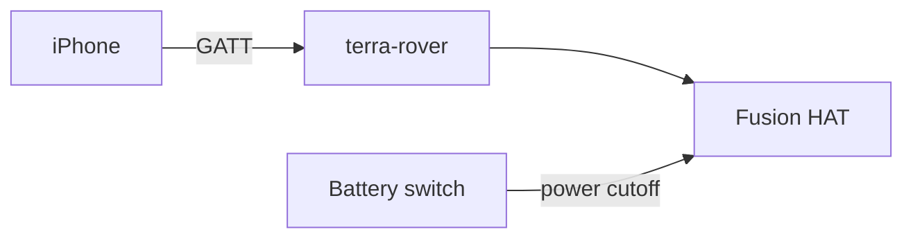
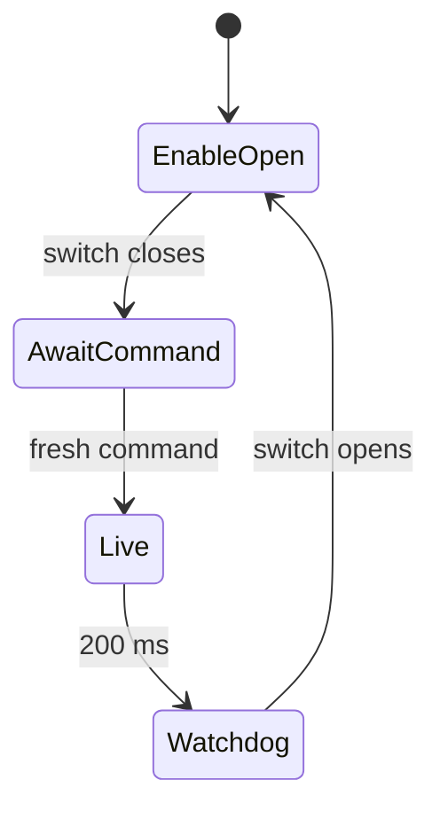

# Install Terra Rover on Raspberry Pi

!!! tip "TL;DR"
    64-bit Bookworm or newer.
    The release is an ARM64 executable. No Python on the Pi.
    Pair with the USR button. Pairing does not arm.


*What the installer is aiming at.*



*The battery switch is external. Connecting does not arm.*

Target: **64-bit Raspberry Pi OS Bookworm or newer**, with systemd and Bluetooth.
The release is a Nuitka-compiled ARM64 Linux executable. It includes the Python
runtime, Bless 0.3.0, Bleak 1.1.1, dbus-next 0.2.3, and the Fusion HAT 1.14.0 Motor/PWM library. You do not
need Python, pip, a virtual environment, or the Terra checkout to run it.
The operating system's BlueZ/D-Bus services and the Fusion HAT **kernel driver**
remain system requirements. A 32-bit OS cannot run this release.

## Build a release

On a Mac or Linux development computer with Docker running, from the Terra root:

```sh
docker buildx build --platform linux/arm64 \
  -f packaging/rover/Dockerfile \
  --output type=local,dest=hardware/raspberry-pi/dist .
```

The build compiles inside ARM64 Debian Bookworm and runs the executable's help
and dependency checks. It also installs the release into a staged image and
executes it in a clean Debian container with no Python installation. It exports:

```text
hardware/raspberry-pi/dist/terra-rover-0.2.0-linux-arm64.tar.gz
hardware/raspberry-pi/dist/terra-rover-0.2.0-linux-arm64.tar.gz.sha256
hardware/raspberry-pi/dist/terra-rover-0.2.0-linux-arm64/
```

Alternatively, compile directly on a Pi. This downloads the pinned compiler and
vendor source; first builds can take several minutes and need free RAM/storage.
Run the build as your ordinary user, not root:

```sh
sudo apt update
sudo apt install -y python3-venv python3-dev build-essential patchelf curl ca-certificates
./scripts/build-rover.sh
```

Use `TERRA_BUILD_JOBS=1 ./scripts/build-rover.sh` on a Pi with limited memory.
A build made on a newer OS is only portable to systems with compatible or newer
glibc; the Docker builder establishes the Bookworm baseline (glibc 2.36).
`build-info.json` records the actual build environment and dependency versions.

## Install the release on the Pi

Copy the archive and its `.sha256` file to the Pi, then run there:

```sh
sha256sum -c terra-rover-0.2.0-linux-arm64.tar.gz.sha256
tar -xzf terra-rover-0.2.0-linux-arm64.tar.gz
cd terra-rover-0.2.0-linux-arm64
sudo apt install -y bluez dbus
sudo ./install.sh
terra-rover --help
terra-rover --check-bundle
```

The installer verifies file checksums and the executable's architecture, creates
the `terra-rover` account, installs the binary at `/usr/local/bin/terra-rover`,
and installs its systemd and account-specific BlueZ D-Bus policy. For a new device it enables and starts the
service, waiting for the USR button without opening motor outputs. Upgrades with
an existing owner remain stopped until explicitly restarted. The dependency check only
imports and validates libraries; it never connects Bluetooth or opens PWM outputs.

The installer supports `./install.sh --root /absolute/image/root` for staging
files into an OS image. That mode does not execute the binary, create accounts,
reload the bus, or operate host services. The image builder must provision the
`terra-rover` user/group, its `i2c`/`bluetooth` group memberships, and ownership of
`/var/lib/terra-rover` before boot.


*An optional Pi interlock can be configured separately.*

## Configure the hardware

The Fusion HAT vendor's matching kernel module and device-tree overlay must
already be installed and loaded. Confirm `/sys/class/fusion_hat/fusion_hat/pwm`
exists and the `terra-rover` account can write its PWM attributes. The binary
bundles only the actuator library; it does not install kernel modules, change
boot configuration, or install the vendor's audio/voice stack.

The release includes the exact Fusion HAT source archive in `sources/`. For a
new board, use the vendor driver instructions with that retained source and the
headers for the Pi's running kernel; building a kernel driver on the development
Mac or in the generic Docker builder cannot replace this Pi-specific step.
See [Fusion HAT deployment requirements](FUSION_HAT.md).

Edit `/etc/terra-rover/rover.env`:

```ini
TERRA_PWM_PORTS=
```

Set `TERRA_PWM_PORTS` only to verified exposed connectors, for example `P0,P1`.
An empty list still permits the board's M0–M3 motor capabilities. The default
service uses the battery's external power cutoff and requires no Pi switch signal.
Configuration requires disarm, and motion requires explicit arming and fresh
commands. The Pi cannot measure the battery switch position.

For an optional Pi-connected interlock, add `--gate-file /path/to/gate` to the
service command. Its producer must provide `0` for confirmed open/isolated and
`1` for closed. Missing/unreadable state blocks configuration and motion in that
explicit mode. The installer does not create a simulated gate file.

## Pair the owner and run

For customers, ship the Pi with the Fusion HAT kernel driver, Bluetooth and this
service installed. No terminal or known phone Bluetooth address is needed:

1. Turn on the rover and install/open TerraPhone.
2. Release the Fusion HAT USR button if held during boot, then hold it for three
   seconds. The LED blinks slowly and a 60-second pairing window opens.
3. Tap **Find rovers**, choose the advertised **terra-XXXXXX**, and connect.
   Accept the phone's Bluetooth pairing prompt if shown. The LED blinks quickly
   while the first phone is enrolling.
4. Three LED flashes confirm the private owner record was saved. The rover
   automatically switches to its normal service; tap **Find rovers** and reconnect.
   The LED stays on. Configure the actuator layout and arm explicitly when safe.

Only one initial button hold is needed.
The generated rover name persists across restarts.
A timeout requires release and another hold; missing/unreadable HAT controls do not open pairing.
Already-owned rovers ignore enrollment holds.
First-owner enrollment uses Bluetooth Just Works: proximity plus the physical window authorizes the first phone, without numeric-code comparison or protection against an active nearby pairing attacker.
Keep enrollment physically supervised.
Pairing never arms or requires a gate file.
Motor operation requires a valid layout and explicit arming.


The button and LED default to `/sys/class/fusion_hat/fusion_hat/button` and
`/sys/class/fusion_hat/fusion_hat/led`. Override `--button-file` and `--led-file`
only for a board whose kernel exposes different attributes.

Developer terminal provisioning remains available with `--setup-owner`,
`--expected-peer` and an explicitly open `--gate-file`; it uses numeric comparison.
Use it with the customer service stopped. Do not run two Bluetooth peripheral
processes at once.

To run in the foreground instead, keep the service stopped and use:

```sh
sudo -u terra-rover terra-rover --pwm-ports P0,P1
```

For a mock backend on a Linux host with a Bluetooth radio, use
`sudo -u terra-rover terra-rover --mock`. Its simulated gate defaults open; add
`--mock-gate-closed` only for mock testing. Never run two peripheral processes at
once. Physically isolate actuator power before stopping or replacing the service;
process exit cannot guarantee continuous ESC stop PWM.



*Watchdog coasts and drops enable. It does not brake.*

## Upgrade or remove

Isolate actuator power, then `sudo systemctl stop terra-rover.service` before
running the new release's installer. It preserves `/etc/terra-rover/rover.env`,
the owner bond JSON, persistent rover name, and saved layouts. Restart the service explicitly after
checking the configuration. Bluetooth bond keys remain managed by BlueZ.

To remove the executable and service while preserving pairing and layouts:

```sh
sudo systemctl disable --now terra-rover.service
sudo rm /usr/local/bin/terra-rover /etc/systemd/system/terra-rover.service
sudo rm /etc/dbus-1/system.d/terra-rover.conf
sudo systemctl daemon-reload
sudo dbus-send --system --type=method_call --print-reply \
  --dest=org.freedesktop.DBus /org/freedesktop/DBus org.freedesktop.DBus.ReloadConfig
```

## Build provenance and validation

The Fusion HAT source is pinned to commit
`4bd1018ad5a70ee113160536f969cdadd9f22918` (version 1.14.0) and its archive hash is
checked before installation. Its exact GPLv3 source and license, the rover source
and build recipe, compilation report, and build metadata accompany every bundle.
Only Motor/PWM and their standard-library imports are included; unrelated vendor
audio, voice, GPIO and display dependencies are deliberately omitted.

Packaging tests check staged installation, upgrade preservation, and rejection of
corrupt, missing, or incompatible files. The build also executes `--help` and
`--check-bundle` from outside the source directory. These checks do not establish
radio behavior, real Pi kernel-driver compatibility, actuator timing, or physical
commissioning. Those require the separate [bench procedure](BENCH.md).


*Physical path. Arming is still a separate step.*


References: [Nuitka standalone/onefile modes](https://nuitka.net/user-documentation/user-manual.html),
[pinned Fusion HAT source](https://github.com/sunfounder/fusion-hat/tree/4bd1018ad5a70ee113160536f969cdadd9f22918).

## Supervised bench mode without a physical interlock

For a supervised rover that has no physical cutoff, `--bench-mode` is an explicit
alternative to `--gate-file`, using the real Fusion HAT backend. It is never the
installer default and cannot be combined with a physical gate or mock mode. The
status reports `gate_mode=bench`; TerraPhone shows the absence of a physical
power cutoff and offers **Enable Bench Control**, followed by a separate **Arm**.
A valid saved layout, cleared fault/Stop, authenticated owner and disarmed state
are required for enabling. Software enable never arms or persists across service
restart, disconnect, Disarm or Stop. Release sends zero; the existing 200 ms rover
watchdog and explicit arming remain active. Configuration requires bench control
to be disabled. Software stop cannot isolate power if software or electronics fail.

On rover2 the source runtime is installed at `/opt/terra-bench/venv`, with a
systemd override at `/etc/systemd/system/terra-rover.service.d/bench-mode.conf`.
The confirmed initial layout is M2/M3 left and M0/M1 right, revision 1; its effort
limits are ±0.4 with maximum power fraction 0.5. Wheel direction still requires
physical observation. The default service uses the external battery cutoff;
physical-gate installations explicitly supply `--gate-file`.
