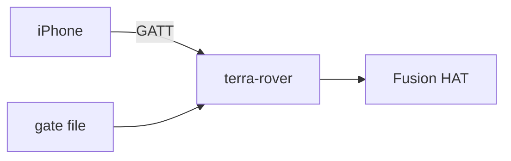

# Bluetooth actuator evidence status

!!! tip "TL;DR"
    Compiled bundle was built and checked.
    Radio timing and the physical bench were not.

*The service this evidence is about.*

*Gate closed is not the same as armed.*

The compiled ARM64 packaging was built and checked on 2026-10-07. See
[compiled release validation](BINARY_BUILD.md) for the artifact digest, executed
checks and limits. Radio and physical hardware verification remain outstanding.
The record below describes the original implementation on 2026-10-06.

Implementation only, as of 2026-10-06. The user's explicit no-testing instruction
superseded the execution plan's acceptance steps. No tests, new test files, builds,
binding generation, smoke/check scripts, screenshots, Linux BLE sessions or physical
hardware checks were performed for this feature. An earlier baseline test command
was interrupted; no completion or passing result is claimed.

The available evidence consists of source changes and read-only source reviews recorded in the task reports and SDD progress ledger.
Those reviews considered schema validation, resource aliases, owner admission, frame freshness, configuration correlation, lifecycle and best-effort safe output paths.
Source review provides no measurement or runtime proof.
In particular, compilation/generated API spelling, BlueZ/iOS pairing and long reads, vendor electrical compatibility, pulse widths, cutoff behavior, 10 ms worker scheduling, 200 ms expiry and 210 ms safe requests remain unverified.
Preservation of Zenoh paths is a source-level implementation claim; regression behavior was not exercised.

The Task 9 automated round-trip test and acceptance runs were deliberately omitted.
No issue acceptance criteria are proven by this directory. Plan test/bench boxes
remain unchecked. [BENCH.md](../BENCH.md) is a proposed optional future procedure,
not a record of work already performed.

If separately authorized later, store portable contract results, mock transport
results, Linux radio captures and physical Fusion HAT measurements separately.
For each include revision, tool/device versions, exact configuration, timestamps,
observations, failures/environment blockers and raw evidence links. Never promote
mocked output or source review into physical compatibility evidence.
