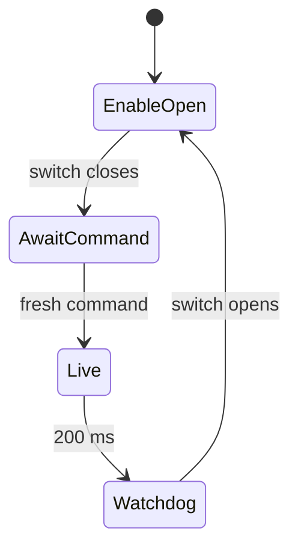

# Hardware

!!! tip "TL;DR"
    64-bit Pi. Executable `terra-rover`. Fusion HAT.
    TerraPhone on an iPhone is the controller.
    The Rust crates do not run on the Pi.

*Gate `0` means open. Gate `1` means closed. Closing it does not arm.*

{ width="200" }

*Artwork from the iOS catalog, not a bench photo.*

| Guide | Use it for |
| --- | --- |
| [Install](INSTALL.md) | Build, `install.sh`, USR enrollment. |
| [Bluetooth](BLUETOOTH.md) | GATT, frames, owner admission. |
| [Fusion HAT](FUSION_HAT.md) | Pins, timers, library 1.14.0. |
| [Bench](BENCH.md) | Wheels-up outline. Not performed. |
| [Evidence](evidence/README.md) | What was checked, and what was not. |

Software twin of the motor checklist: [terra-motors](../crates/terra-motors.md).

*Zero effort coasts. A dropped enable still coasts. It does not brake.*
