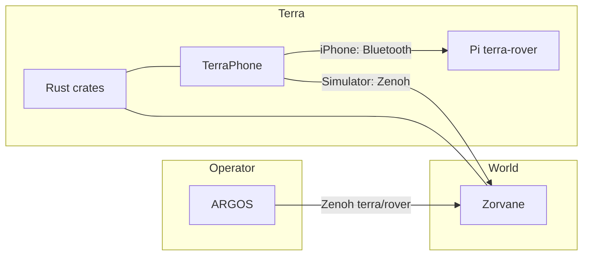

# Terra

Terra is the vehicle body and the software that rides on it: shared Rust crates, the TerraPhone iOS app, and the Raspberry Pi rover service. It sits between the operator and the world.

| Part | Role |
| --- | --- |
| [super-yojan.dev](https://super-yojan.dev) | Personal site. It links here, to ARGOS, and to Zorvane. |
| [ARGOS](https://super-yojan.dev/ARGOS/) | Fleet operator. Map-level intent, commands, and the dashboard. |
| Terra (this site) | Onboard autonomy, TerraPhone, and the Pi body. |
| [Zorvane](https://super-yojan.dev/Zorvane/) | World simulator, extracted from Terra. |

Zenoh topics keep the prefix `terra/rover`. A simulated rover and a physical rover are different links: the iOS Simulator talks to Zorvane over Zenoh, and a physical iPhone talks to the Pi over Bluetooth.

## What is in this repository

- **Rust workspace** (`crates/`): types, state, velocity control, waypoints, Zenoh transport, mapping, local planning, the autonomy arbiter, experiment logs, motor PWM, actuator layouts, and the UniFFI phone boundary.
- **TerraPhone** (`mobile/ios/`): SwiftUI app. Shared control code comes from `terra-mobile`.
- **Raspberry Pi service** (`hardware/raspberry-pi/`, `packaging/rover/`): a compiled ARM64 executable that exposes the actuator protocol over Bluetooth and drives a Fusion HAT.

The Bevy world that used to live in `simulator/` is [Zorvane](https://super-yojan.dev/Zorvane/). Run it from that checkout with `cargo run -p zorvane`.

## Read next

- [Architecture](architecture.md) for the onboard pipeline and the phone/Pi split.
- [Getting started](getting-started.md) for tests, the iOS build, and the simulator.
- [Crates](crates/index.md) for each workspace member.
- [Zenoh](zenoh.md) for keys under `terra/rover`.
- [TerraPhone](phone/index.md) for Xcode, Simulator versus iPhone, pairing, and planned tap-to-configure.
- [Hardware](hardware/index.md) for the Pi installer, Bluetooth, and the wheels-up bench.
- [Rust API](https://super-yojan.dev/Terra/api/) for `cargo doc` of the workspace crates.

## What is built, and what is still planned

The crates, the TerraPhone connection split, the Pi packaging path, and the Bluetooth protocol are in the tree. A few things are still ahead of the code, or have not been exercised on hardware:

- **Planned:** 3D tap-to-configure and a vehicle description format that maps model parts to actuators ([Terra #27](https://github.com/Super-Yojan/Terra/issues/27)). Configuration today is a list form.
- **Planned:** fleet and RGB Zenoh subscriptions, and a reconnection UI, called out as follow-ups in `terra-transport`.
- **Loopback only:** the phone dashboard endpoint accepts `tcp/127.0.0.1` and refuses other addresses.
- **Unverified on hardware:** radio sessions, actuator timing, and physical commissioning. The [evidence record](hardware/evidence/README.md) separates source review and the compiled-binary checks from a bench that has not been run. The [bench procedure](hardware/BENCH.md) needs separate authorization.
