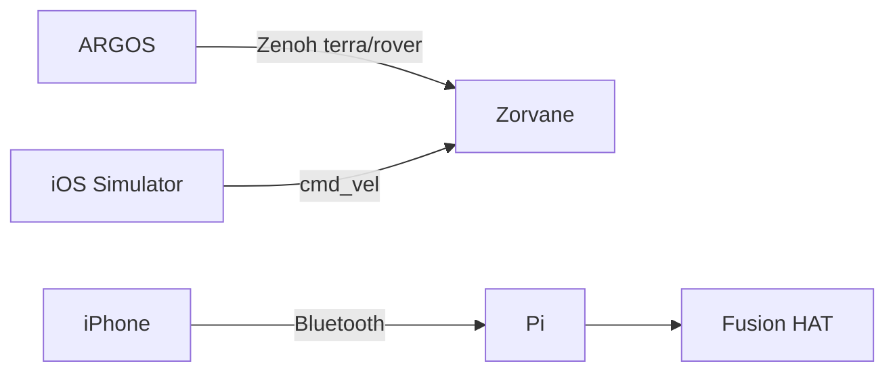

# Terra

!!! tip "TL;DR"
    Terra is the rover body: Rust crates, TerraPhone, and the Pi.
    [ARGOS](https://super-yojan.dev/ARGOS/) commands the fleet.
    [Zorvane](https://super-yojan.dev/Zorvane/) is the world.
    Simulator uses Zenoh. A real iPhone uses Bluetooth.

{ width="240" }

*Shipped app icon from `Assets.xcassets`. This is the rover artwork in the iOS app.*

*One prefix, `terra/rover`. Two different phone links.*

## Pick a path

-   **Architecture**

    ---

    Crates, phone split, and the Pi.

    [Open the map](architecture.md)

-   **TerraPhone**

    ---

    Xcode, Simulator, Bluetooth, planned tap-to-configure.

    [Open the phone guide](phone/index.md)

-   **Zenoh keys**

    ---

    `cmd_vel`, depth, goals, autonomy.

    [Open the key list](zenoh.md)

-   **Pi hardware**

    ---

    Install, pairing, gate, bench.

    [Open the Pi guide](hardware/index.md)

*Generated splash in `MountainBackdrop`. The interactive model is separate: `rover.usdz`.*

## What is already in the tree

- Rust workspace under `crates/`. Version `0.1.0`.
- TerraPhone in `mobile/ios/`.
- Pi service `terra-rover` `0.2.0` in `hardware/raspberry-pi/`.

The old `simulator/` tree is gone. Run the world from Zorvane: `cargo run -p zorvane`.

## Still ahead

!!! warning "Planned or unverified"
    Tap-to-configure and a vehicle-description format are [Terra #27](https://github.com/Super-Yojan/Terra/issues/27).
    RGB Zenoh and a reconnection UI are follow-ups.
    The phone dashboard listens only on `tcp/127.0.0.1`.
    Radio sessions and the physical bench have not been run. See [evidence](hardware/evidence/README.md).

Rust API docs: [super-yojan.dev/Terra/api/](https://super-yojan.dev/Terra/api/).
