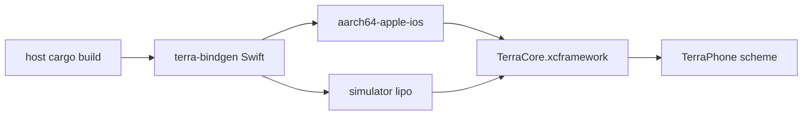

# Building in Xcode

!!! tip "TL;DR"
    Needs a Mac, Xcode, and iOS 17.
    `./scripts/build-ios.sh` makes the XCFramework.
    Linux CI does not run `xcodebuild`.

{ width="180" }

*Generated Rust bindings are gitignored under `mobile/ios/Generated/`.*



*Three Rust targets: device, arm64 simulator, x86_64 simulator.*

```sh
rustup target add aarch64-apple-ios aarch64-apple-ios-sim x86_64-apple-ios
./scripts/build-ios.sh
./scripts/check-swift.sh
open mobile/ios/TerraPhone.xcodeproj
```

{ width="240" }

*Simulator destination for Zenoh. Physical iPhone for Bluetooth. Set a signing team for the phone.*

Rebuild the mesh on a Mac with `usdcat` and `usdzip`:

```sh
python3 scripts/prepare-ios-rover.py /path/to/robot.usdc
```

The preview keeps about 853,000 of 3.5 million triangles. The original CAD file is not in git.
