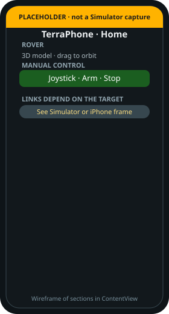

# TerraPhone

!!! tip "TL;DR"
    SwiftUI app in `mobile/ios/`.
    Shared math is `terra-mobile`.
    Simulator talks to Zorvane. iPhone talks to the Pi.
    Tap-to-configure is not built.

{ width="220" }

*Real asset. The frames below are wireframes, not Simulator captures.*

{ width="260" }

*One controller backs every screen. Connection never arms the motors.*

## What you can do today

- Orbit the bundled `rover.usdz`. Pinch to zoom. Reset View restores the camera.
- Drive with a joystick, Arm, and Stop. Dead zone is 8%.
- Pick teleop, assisted, waypoint, or supervised search.
- See a local occupancy grid.

*`MountainBackdrop` is generated art. The CAD model is the rover, not this photo.*

## Where to go

| Question | Page |
| --- | --- |
| How do I compile it? | [Xcode](build.md) |
| Simulator or iPhone? | [Split](simulator.md) |
| How do I pair? | [Bluetooth](bluetooth.md) |
| Tap a part to configure? | [Planned](tap-to-configure.md) |

Long-form sensor notes: [Phone controller](../MOBILE_CONTROL.md).

!!! note "Mount"
    Flat phone. Screen up. Top edge forward.
    Loss of ARKit tracking commands neutral effort.
    Calibrate before the wheels touch the ground.
