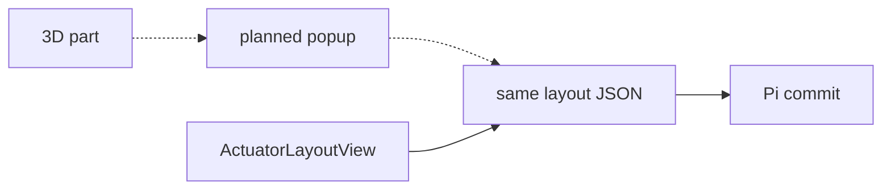

# Tap to configure

!!! warning "Planned"
    [Terra #27](https://github.com/Super-Yojan/Terra/issues/27) is open.
    The 3D model does not edit actuators today.

{ width="200" }

*`RoverModelView` loads `rover.usdz`, orbits, and zooms. No tap handler selects a part.*

{ width="260" }

*Today’s editor is the list `ActuatorLayoutView`: Discover, configure and arm.*

## What #27 asks for

- A configuration mode with the vehicle mesh.
- Tap a motor. A small popup opens.
- First control: invert direction.
- Commit through the same stage and commit path as the list.

*Solid arrow exists. Dotted arrows are #27.*

There is no vehicle-description format in this repo. The USDZ is a viewing mesh. Actuator identity is numeric ids in the layout JSON.

Related: [Terra #22](https://github.com/Super-Yojan/Terra/issues/22) and [Terra #23](https://github.com/Super-Yojan/Terra/issues/23).
