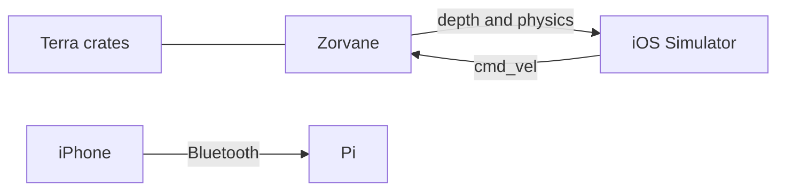
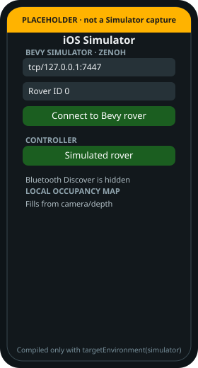

# Simulation

!!! tip "TL;DR"
    The world is [Zorvane](https://super-yojan.dev/Zorvane/).
    Command: `cargo run -p zorvane`.
    Prefix stays `terra/rover`.
    Only the iOS Simulator joins that peer.



*Terra keeps the follower, mapper, planner, and arbiter. Zorvane keeps cameras and physics.*

{ width="240" }

*Same Mac: `TERRA_ZENOH_LISTEN=tcp/0.0.0.0:7447`. Phone field: `tcp/127.0.0.1:7447`.*

## Mission

```sh
TERRA_MISSION=1 TERRA_MISSION_SEED=42 TERRA_ROVER_COUNT=2 cargo run -p zorvane
```


*Pick a level before a waypoint. Stop stays latched until reset.*

Autonomous explore is `{"level":"explore","token":"explore-1","budget_seconds":180}` on `terra/rover/<id>/autonomy`. See [start an exploration run](autonomy/README.md#start-an-exploration-run).

Summarize a log from this repo:

```sh
cargo run -p terra-experiment --bin terra-run-summary -- /path/to/run.jsonl
```

Tile and bridge notes stay in Zorvane: [WORLD.md](https://github.com/Super-Yojan/Zorvane/blob/main/simulator/WORLD.md) and [ZENOH.md](https://github.com/Super-Yojan/Zorvane/blob/main/simulator/ZENOH.md).

## Not the simulator

**Simulated rover** inside TerraPhone is a local plant.

**Phone IMU + VIO** reads the handset.

Neither one starts Zorvane. The Docker world image moved with the simulator. This repo's image is the Pi. See [Containers](DOCKER.md).
