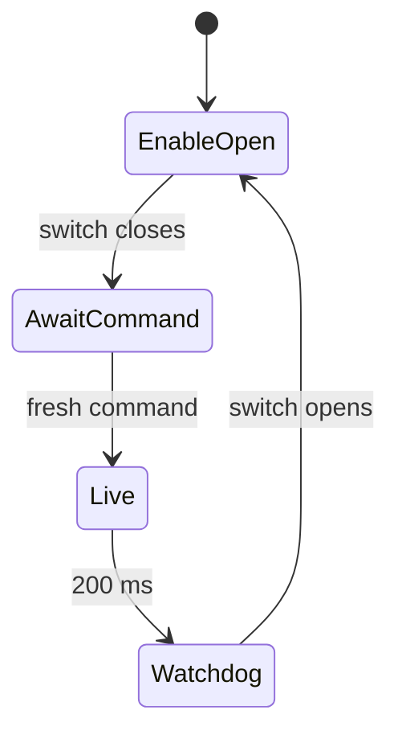
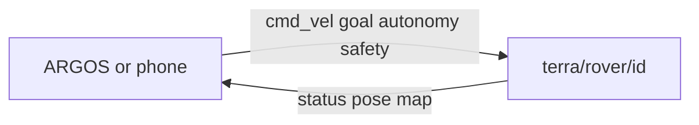

# Headless customer pairing with the Fusion HAT button

!!! tip "TL;DR"
    Spec for headless first-owner pairing.
    The button opens a window. It does not arm.

*Customer steps from the spec.*

*Pairing window is 60 seconds. Motors stay off.*

## Approved customer intent

A new customer receives a provisioned Raspberry Pi with a Fusion HAT, installs
TerraPhone, and pairs locally over Bluetooth without SSH, Wi-Fi, a terminal,
or knowledge of either Bluetooth address. Holding the HAT's USR button opens
pairing; its LED indicates pairing mode. The advertised name is
`terra-` followed by random alphanumeric characters.

The user explicitly chose **one initial long press only**.
There is no second button confirmation and no numeric-code comparison on the Pi.
The implementation uses Bluetooth Just Works bonding with a physically opened, limited pairing window.
This provides encrypted communication after bonding but not the man-in-the-middle protection of numeric comparison.
The random device name is a discovery identifier, not a password or proof of identity.
Another nearby phone can compete for the pairing window; only one candidate may be accepted.

## Customer experience

1. The installed service starts on boot. An unowned device waits for its button;
   missing `owner.json` is an expected first-boot state, not a crash.
2. Hold USR continuously for three seconds. The LED starts blinking at 1 Hz and
   the setup-only Terra BLE service advertises for at most 60 seconds.
3. In TerraPhone, scan and select `terra-A7K9Q2` (example), then connect. The app
   triggers the encrypted setup read that requests Bluetooth pairing. The phone
   handles its normal OS pairing prompts, if any.
4. The first eligible pairing request claims the window. The LED blinks at 4 Hz
   while pairing completes. Subsequent candidates are rejected.
5. When that candidate has been approved by the pairing agent and is both paired
   and bonded, persist its BlueZ identity atomically. Flash the LED three times,
   disable new pairing, and transition to the normal peripheral automatically.
6. The app reports pairing saved and offers reconnecting to the same rover. It
   must never instruct the customer to start a Pi service. Reconnection does not
   arm motors.
7. Timeout, cancellation, disconnect or hardware-input failure closes the window,
   cleans up setup resources, and returns to waiting. Another attempt requires
   releasing the button and performing a new three-second hold.

The device name uses six characters chosen with the system cryptographic random
generator from uppercase ASCII letters and digits. Generate and save it once
under `/var/lib/terra-rover`, retaining it across pairing retries and reboots.
Discovery also uses CoreBluetooth's advertised local name so cached peripheral
names do not obscure the new name. The app identifies reconnect targets using
the existing stable CoreBluetooth peripheral identifier, not name alone.

*Pairing window is 60 seconds. Motors stay off.*

## Ownership and service lifecycle

Separate the background lifecycle from the current terminal provisioning path.
An orchestration component owns the waiting, pairing, and owned-service states.
Only one GATT application and one advertisement are registered at any time.

For an unowned device, do not construct, configure or run an actuator backend.
Pairing exposes setup status only and no drive, arm or configuration write API.
The physical motor-gate file is not required to discover and pair an unowned
device. It remains mandatory for real motor operation and layout changes after
pairing. Button authorization is not the motor safety gate.

*Physical path. Arming is still a separate step.*

Once owned, retain the current owner-only admission, interlock, layout validation
and explicit arming behavior. A missing/unavailable motor gate must keep motion
disabled but must not invalidate the saved phone identity. Existing owner files
must be validated; malformed, unreadable or insecure files produce an actionable
fault and must never be treated as an invitation to pair a replacement phone.

This change does not add owner replacement or factory reset. On an owned device,
long presses do not open a new pairing window, replace the owner or alter motion.
The original explicit terminal provisioning command may remain as a developer
option, preserving its numeric-confirmation behavior. The installed customer
service uses the button flow and does not require `--expected-peer` or stdin.

## Hardware interface

Use the pinned Fusion HAT kernel driver's sysfs interfaces:

- `/sys/class/fusion_hat/fusion_hat/button`: read strict `0` or `1`.
- `/sys/class/fusion_hat/fusion_hat/led`: write `0` or `1`.

Use asynchronous polling with a monotonic clock, approximately every 50 ms,
and debounce press/release for 100 ms. Recognize one long press per release
cycle. A button already held at process startup must be released before it can
authorize a window. Missing, unreadable or invalid input cannot authorize
pairing; LED write failure prevents entering pairing and cancels an open window.
Retry hardware availability without advertising pairing automatically.

Waiting/unowned LED is off. Setup is slow blink, pending candidate is fast blink,
successful ownership is three flashes followed by steady on. Owned-service
hardware faults use a distinguishable repeated double flash. Shutdown attempts
to turn the LED off. Keep all LED work separate from the output worker.

Read/write paths can be overridden for portable tests and alternative hardware;
the customer service defaults to the HAT paths. No evdev, GPIO library, audio or
voice dependencies are added. The existing bundled actuator library is retained.

*Watchdog coasts and drops enable. It does not brake.*

## Pairing boundary and persistence

Register a setup agent with the headless `NoInputNoOutput` capability. Authorization
is permitted only during the locally triggered window. Claim a single BlueZ
device path when handling the incoming pairing authorization; subsequent callbacks
must match that exact candidate and setup generation. Never accept callbacks
outside the deadline, after cancellation, or for a different candidate.

*Physical path. Arming is still a separate step.*

Owner persistence requires all of the following: agent approval for this window,
matching candidate identity, BlueZ `Paired` and `Bonded`, a completed setup-status
read by that candidate, and a still-live deadline. If the platform does not invoke
the expected authorization callback, fail closed rather than infer local approval.
This behavior must be verified on Raspberry Pi BlueZ with iOS.

Reject other connected centrals during setup.
Clean up newly created unsuccessful candidate bonds on failure; never remove a pre-existing bond belonging to another device.
Record pre-window bond state to distinguish them.
A previously bonded candidate without fresh authorization is not eligible for first-owner enrollment.
Timeout/failure clears transient candidate state and exports.
Attempt all cleanup operations even if the adapter or bus disappears.
Disable pairability and discoverability on every exit, and apply BlueZ's own timeout as an additional bound.

Save `owner.json` with mode 0600 using an atomic write, file fsync, rename and
directory fsync. Save identity address and address type as the normal peripheral
expects. Reject conflicting existing ownership; never overwrite it. If saving or
cleanup fails, expose a recoverable error rather than enable motor control.

## App and packaging changes

Update TerraPhone's existing setup detection/status text to explain the long press,
timed pairing, and automatic service transition. Keep scan/connect explicit. Clear
setup state after completion or failure; reconnect only by customer action and
keep all drive controls disarmed. Unexpected normal characteristics during setup,
unconfirmed setup responses, or stale connection callbacks remain errors.

Update the service command to select the customer lifecycle and HAT button/LED
defaults. The installer starts/enables that service for first-boot availability
only after dependency checks succeed; it must not open pairing by itself. Preserve
owner, saved name, layout and environment configuration on upgrades. Document that
the factory image still needs the matching Fusion HAT kernel module/overlay; this
work does not manufacture or commission a complete customer OS image.

Rebuild the ARM64 Nuitka bundle and update installation instructions to remove
SSH/terminal provisioning from the customer flow. Include defaults and source in
the release, preserving the existing reproducible build and clean-runtime checks.

*Keys hang off `terra/rover/<id>/`.*

## Verification and acceptance

*Physical path. Arming is still a separate step.*

Use fake time and temporary input files for the button/LED state machine. Test
debounce, startup-held button, the exact hold threshold, one window per release,
timeout, invalid/missing input, and LED failure. Test owner/name persistence and
invalid owner handling independently of Bluetooth.

Use controlled D-Bus doubles for authorization and lifecycle boundaries: only one
candidate, concurrent competing requests, missing callback, stale callbacks,
pairing cancellation, interrupted persistence, failed cleanup, and restart after
successful ownership. Verify setup never creates actuator objects or exposes
motion writes, and that setup-to-normal transition releases old GATT resources
before registering normal ones. Retain the packaging tests and workspace checks.

Validate TerraPhone setup messages and explicit reconnection behavior, including
advertisement local-name discovery. Rebuild and execute the ARM64 release in a
clean Linux container with no Python, and verify its installed service unit.

Final physical acceptance requires a Pi/HAT and iPhone: hold button, observe LED,
discover the name, pair without SSH or a known address, observe automatic normal
service startup, reboot and reconnect to the same owner, reject another phone,
and recover from timeout. Report those checks as unverified when the physical
devices are unavailable; container/mock checks are not radio evidence.

## References

- [BlueZ Agent API](https://bluez.readthedocs.io/en/latest/agent-api/)
- [Bluetooth numeric comparison](https://www.bluetooth.com/blog/bluetooth-pairing-part-4/)
- [Pinned Fusion HAT kernel/source](https://github.com/sunfounder/fusion-hat/tree/4bd1018ad5a70ee113160536f969cdadd9f22918)
