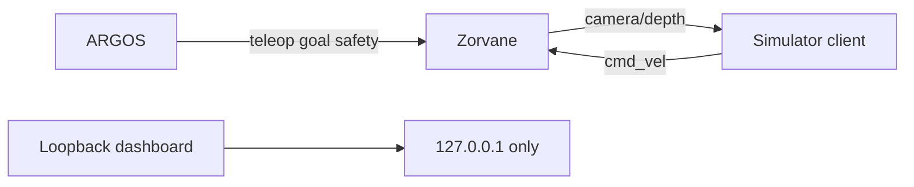
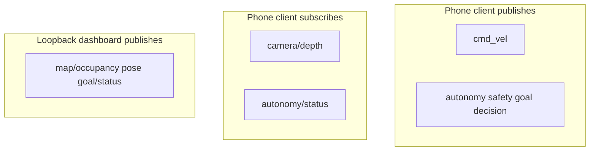

# Zenoh

!!! tip "TL;DR"
    Prefix: `terra/rover/<id>/…`
    Simulator client publishes `cmd_vel` at 20 Hz.
    Lease is 250 ms, then zeros.
    iPhone does not open this socket. It uses Bluetooth.

*Two Terra sessions. They are not the same socket.*

| Session | Who | Address |
| --- | --- | --- |
| `RoverConnection` | Simulator only | Any `tcp/` endpoint. Usually `tcp/127.0.0.1:7447`. |
| `ControlPlane` | `host_dashboard` | `tcp/127.0.0.1` only. `0.0.0.0` is rejected. |

{ width="240" }

*Device builds delete `zenohEndpoint` on launch.*

## Keys

*RGB and a client fleet subscription are planned.*

| Key | What moves |
| --- | --- |
| `cmd_vel` | `{"linear","angular"}` only. Within ±2. 20 Hz. |
| `teleop` | Stick, plus optional session and sequence. |
| `goal` | `cancel`, or `local` / `wgs84`. |
| `goal/status` | `idle`, `active`, `arrived`. |
| `goal/proposal` | A supervised target. `null` means none. |
| `goal/decision` | `approve`, `reject`, or `resume`. |
| `autonomy` | `teleop`, `assisted_teleop`, `waypoint`, `supervised`, `explore`. |
| `autonomy/status` | Assigned, requested, effective. Includes `exploration` once a run has started. |
| `exploration/status` | Budget, target, coverage, end reason. Omitted while idle. |
| `safety` | `stop` or `reset`. |
| `camera/depth` | Version 1, `32FC1_LE`, then f32 metres. |
| `pose` | `x`, `y`, `yaw`. |
| `map/occupancy` | Observed cells. At most every 0.2 s. |
| `experiment/status` | Run id and recording flag. |
| `mission/status` | Filled by the Zorvane scenario. |
| `fleet/state` | Loopback only. One id. |

Full authority rules: [contract](autonomy/PROTOCOL.md).

*Depth is axial Z, not ray length. Frames without an exposure pose are dropped.*

## Depth, briefly

Header needs `version` 1, `vertical_fov`, and camera `x,y,z,qx,qy,qz,qw`.

Optional `body` pose supplies rover `x`, `y`, `yaw`.

Default 256×192 is about 1.9 MiB/s before protocol overhead.

!!! note "Session open"
    That status means TCP is up.
    It does not mean the rover moved.
