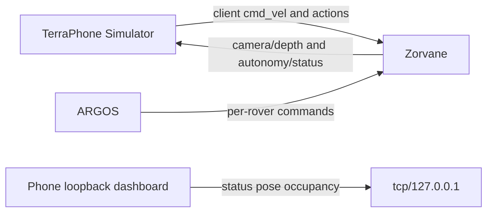

# Zenoh

The prefix is **`terra/rover`**. Rover keys hang off `terra/rover/<id>/`. Terra uses that prefix for the phone, the loopback dashboard, and the contract ARGOS and Zorvane share. Zorvane's listen address defaults to `tcp/127.0.0.1:7447`.

Two Terra sessions exist. They are not the same socket.

| Session | Who opens it | Address |
| --- | --- | --- |
| `RoverConnection` | TerraPhone, **iOS Simulator only**, as a Zenoh client | Any `tcp/` endpoint. The usual Simulator value is `tcp/127.0.0.1:7447`. |
| `ControlPlane` | `MobileController.host_dashboard` | **`tcp/127.0.0.1` only.** Other addresses, including `tcp/0.0.0.0:7447`, return `InvalidSettings`. |

A physical iPhone does not open `RoverConnection`. Bluetooth is that phone's link to the Pi. See [Simulator and iPhone](phone/simulator.md).

## Keys

Payloads are JSON unless the depth row says otherwise. Unknown fields are rejected by the autonomy codecs. Requests are at most 2048 bytes. The full authority rules are in the [autonomy contract](autonomy/PROTOCOL.md).

| Key | Terra's role | Body |
| --- | --- | --- |
| `terra/rover/<id>/cmd_vel` | Client publishes at 20 Hz. Control plane also accepts it as an inbox alias. | `{"linear","angular"}` only. Finite, within ±2. Lease on the client is 250 ms, then zeros. |
| `terra/rover/<id>/teleop` | Control plane accepts it. | Linear, angular, and optional `operator_session_id`, `sequence`, `run_id`, `authority_revision`. |
| `terra/rover/<id>/goal` | Client can `send_action`. Control plane accepts it. | `{"cancel":true}`, or `frame` `local` / `wgs84`. See [terra-waypoint](crates/terra-waypoint.md). |
| `terra/rover/<id>/goal/status` | Dashboard publishes. | `WaypointStatus`: `idle`, `active`, or `arrived`. |
| `terra/rover/<id>/goal/proposal` | Dashboard publishes. | Run id, proposal id, local target, map revision, expiry, reason. JSON `null` means none. |
| `terra/rover/<id>/goal/decision` | Client can send. Control plane accepts. | `approve`, `reject`, or `resume`, with `run_id` and `token`. |
| `terra/rover/<id>/autonomy` | Client can send. Control plane accepts. | `{"level":"teleop","token":"..."}` and the other three levels. |
| `terra/rover/<id>/autonomy/status` | Client subscribes. Dashboard publishes. | Assigned, requested, and effective level, safety, revision, token, supported levels, paused. |
| `terra/rover/<id>/safety` | Client can send. Control plane accepts. | `{"action":"stop","token":"..."}` or a guarded reset. |
| `terra/rover/<id>/camera/depth` | Client subscribes. | Version-1 header, encoding `32FC1_LE`, newline, then little-endian f32 metres. Header includes exposure time, vertical FoV, camera pose, and optional body pose. |
| `terra/rover/<id>/camera/rgb` | Not subscribed. | **Planned.** The transport readme lists RGB as a follow-up. |
| `terra/rover/<id>/pose` | Dashboard publishes. | `rover_id`, `sequence`, `x`, `y` metres, `yaw` radians. |
| `terra/rover/<id>/map/occupancy` | Dashboard publishes at most every 0.2 s. | Observed grid only. Schema 1, sizes, resolution, origin, row-major cells: −1 unknown, 0–100 probability. |
| `terra/rover/<id>/experiment/status` | Dashboard publishes. | Run id, schema version, run-relative time, UTC sample, recording flag. |
| `terra/rover/<id>/mission/status` | Contract key. The mission runtime that fills it lives with the Zorvane scenario. | Objective, phase, budget, confirmed count, observed survivor locations. Hidden targets are omitted. |
| `terra/rover/<id>/mission/report` | Contract key for confirming a sighting. | `{"survivor_id","token"}`. |
| `terra/rover/fleet/state` | Loopback control plane publishes every 100 ms. | `{"count":1,"max_count":1,"ids":[<id>]}` for that one dashboard rover. A fleet subscription on the phone client is **planned**. |

`cmd_vel` from `RoverConnection` is the two-field velocity packet. The autonomy contract treats `cmd_vel` as a leased operator inbox that does not bypass the arbiter when the arbiter is the receiver. Zorvane applies that on the simulator side. The phone client itself does not run the arbiter on the bytes it publishes.

Session-open status on the phone means the TCP session is up and counts posed depth frames. It does not mean a rover acknowledged motion. Commands for an id Zorvane is not simulating are ignored there. Stopping a physical actuator when the link drops is the Pi watchdog's job, documented in [Bluetooth](hardware/BLUETOOTH.md) and [terra-motors](crates/terra-motors.md).

## Depth packet

`decode_depth_frame` requires:

- `version` 1 and `encoding` `32FC1_LE`
- `width` and `height` in `1..=2048`, and a pixel buffer of exactly `width * height` little-endian f32 values
- finite `exposure_time` ≥ 0 and `vertical_fov` in `(0, π)`
- camera `x,y,z,qx,qy,qz,qw`
- optional `body.x`, `body.y`, `body.yaw`

Focal length is derived from the vertical field of view. The principal point is `(width/2 − 0.5, height/2 − 0.5)`. At Zorvane's default 256×192 the stream is about 1.9 MiB/s before protocol overhead. Only the Simulator build subscribes.

## What is still planned

- RGB subscription, a fleet/state subscription on the client, and a reconnection UI.
- Hosting the phone dashboard on anything other than loopback. The autonomy guide records that LAN exposure was rejected and remains a separate decision.
